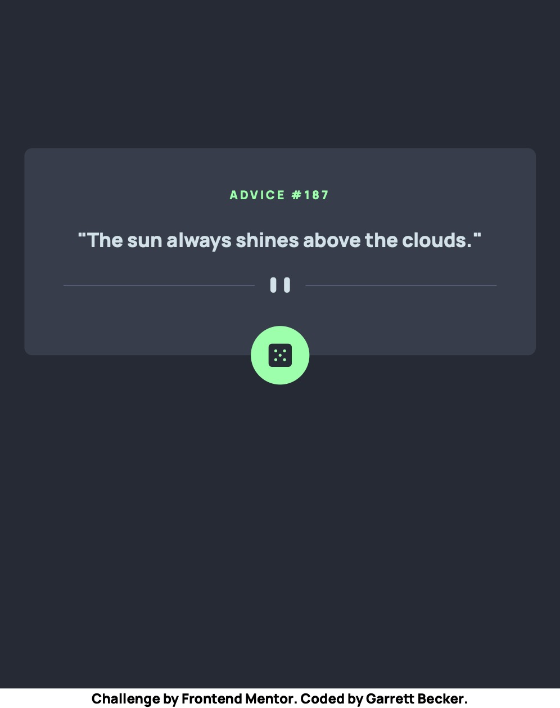
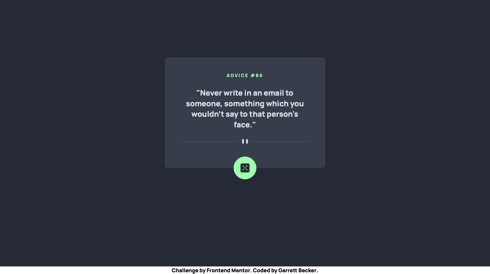

# Frontend Mentor - Advice Generator App Solution

This is my solution to the [Advice generator app challenge on Frontend Mentor](https://www.frontendmentor.io/challenges/advice-generator-app-QdUG-13db). I'm super thankful to have found Frontend Mentor as a great way to confidently grow in my coding skills with real-life projects. 

## Table of contents

- [Overview](#overview)
  - [Project Brief](#project-brief)
  - [Mobile View](#mobile-view)
  - [Desktop View](#desktop-view)
  - [Links](#links)
- [My process](#my-process)
  - [Built with](#built-with)
  - [What I learned](#what-i-learned)
  - [Continued development](#continued-development)
  - [Useful resources](#useful-resources)
- [Author](#author)
- [Acknowledgments](#acknowledgments)

## Overview

### [Project Brief](./project%20brief/)

Your challenge is to build out this advice generator app using the [Advice Slip API](https://api.adviceslip.com) and get it looking as close to the design as possible.

You can use any tools you like to help you complete the challenge. So if you've got something you'd like to practice, feel free to give it a go.

Your users should be able to:

- View the optimal layout for the app depending on their device's screen size
- See hover states for all interactive elements on the page
- Generate a new piece of advice by clicking the dice icon

Want some support on the challenge? [Join our Slack community](https://www.frontendmentor.io/slack) and ask questions in the **#help** channel.

### Mobile View



### Desktop View




### Links

- [Solution URL](https://www.frontendmentor.io/solutions/advice-app-with-next-tailwind-8S94c3c-U-)
- [Live Site URL](https://advice-app-gdbecker.netlify.app)

## My process

### Built with

- [React](https://reactjs.org/) - JS library
- [Next.js](https://nextjs.org) - React framework
- HTML5
- CSS
- [Tailwind CSS](https://tailwindcss.com) - CSS framework
- Mobile-first workflow
- [VS Code](https://code.visualstudio.com)

### What I learned

I love any chance I get to practice using public APIs - they're a great way to not only get familiar with receiving external data, but also become more accustomed to reading unfamiliar documentation and figuring out what's needed to make them work. It always feels satisfying connecting to one and making it work! As with the other Frontend Mentor challenges I approached this one by first working on the design and getting that up before tackling the API connection. I made the homepage itself use client side rendering to house the fetch data function, which is fed into the advice app component to be called when the button is clicked. Really happy with out this turned out! I enjoyed working on this one and ended up making a similar app with a free cat facts API located [here](https://github.com/gdbecker/next-js-cat-facts) for extra practice.

Here are a few code samples from this project:

```html
<!-- Advice app main content -->
<p className="text-green text-center text-xs tracking-[0.2em] pt-10 pb-2">ADVICE #{data.id}</p>
<h3 className="text-cyan text-xl py-4">"{data.advice}"</h3>
<div className="flex flex-row">
  <Image 
    src={IconDividerDesktop}
    alt="icon-divider"
    width={'120%'}
    height={'100%'}
    className="mx-auto py-2"
  />
</div>
```

```css
/* Importing custom font into my CSS file */
@font-face {
  font-family: Manrope-ExtraBold;
  src: url(../../public/Manrope-ExtraBold.ttf);
}
```

```js
// Call function for grabbing new data
const fetchNewData = async () => {
  const response = await fetch(
    'https://api.adviceslip.com/advice', {
      headers: {
        "Accept": "application/json"
      }
    }
  );  
  const data = await response.json();
  console.log(data);

  setData({
    id: data.slip.id,
    advice: data.slip.advice
  });

  setLoading(false)
}
```

### Continued development

As a starter developer, I want to keep growing in working as a team and learning how to deliver smaller packages of code at a time, such as robust and beautiful components like this one. I thought this project was a good way to get back into React and begin doing just that!

### Useful resources

- [CSS Formatter](http://www.lonniebest.com/FormatCSS/) - I found this helpful site when I'm feeling lazy and don't want to format my CSS code, I can have this do it for me, especially putting everything in alphabetical order.
- [Tailwind Grid](https://tailwindcss.com/docs/grid-template-columns) - Handy guide from Tailwind's docs about using grid-cols to structure content

## Author

- Website - [Garrett Becker]()
- Frontend Mentor - [@gdbecker](https://www.frontendmentor.io/profile/gdbecker)
- LinkedIn - [Garrett Becker](https://www.linkedin.com/in/garrett-becker-923b4a106/)

## Acknowledgments

Thank you to the Frontend Mentor team for providing all of these fantastic projects to build, and for our getting to help each other grow!