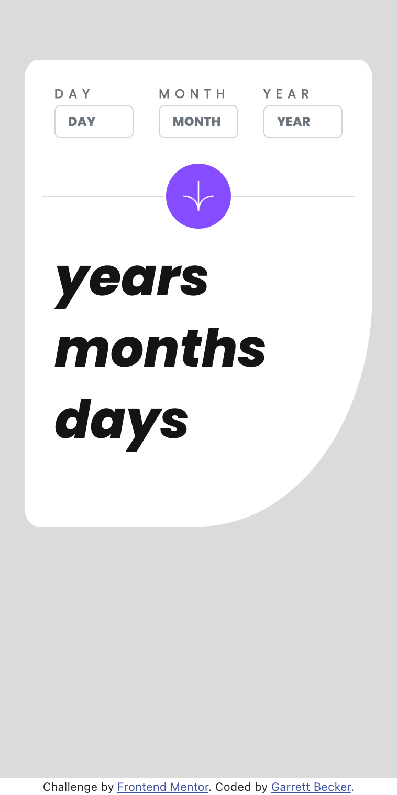
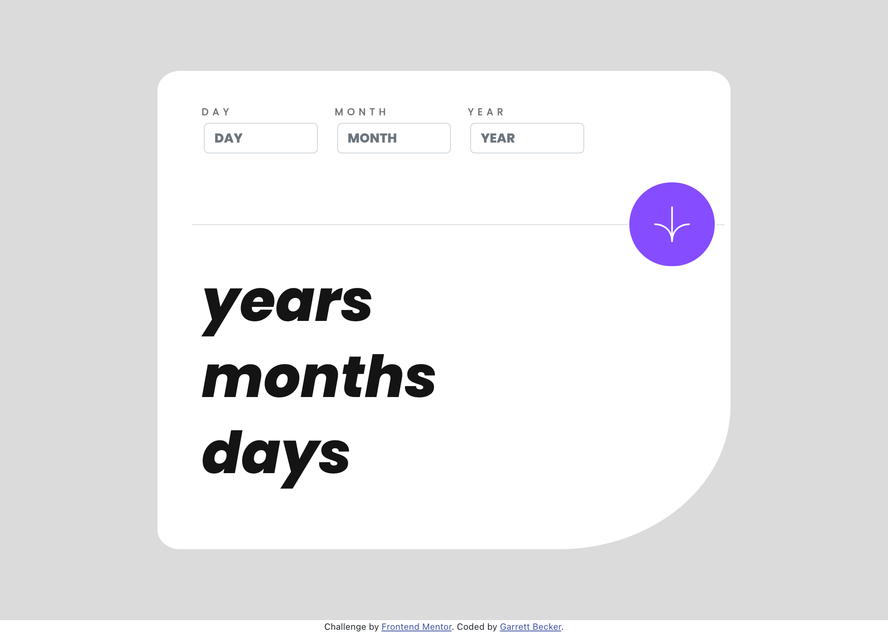

# Frontend Mentor - Age Calculator App Solution

This is my solution to the [Age calculator app challenge on Frontend Mentor](https://www.frontendmentor.io/challenges/age-calculator-app-dF9DFFpj-Q). I'm super thankful to have found Frontend Mentor as a great way to confidently grow in my coding skills with real-life projects. 

## Table of contents

- [Frontend Mentor - Age Calculator App Solution](#frontend-mentor---age-calculator-app-solution)
	- [Table of contents](#table-of-contents)
	- [Overview](#overview)
		- [Project Brief](#project-brief)
		- [Mobile View](#mobile-view)
		- [Desktop View](#desktop-view)
		- [Links](#links)
	- [My process](#my-process)
		- [Built with](#built-with)
		- [What I learned](#what-i-learned)
		- [Continued development](#continued-development)
		- [Useful resources](#useful-resources)
	- [Author](#author)
	- [Acknowledgments](#acknowledgments)

## Overview

### [Project Brief](./project%20brief/)

Your challenge is to build out this calculator app and get it looking as close to the design as possible.

You can use any tools you like to help you complete the challenge. So if you've got something you'd like to practice, feel free to give it a go.

Your users should be able to:

- See the size of the elements adjust based on their device's screen size
- Perform mathematical operations like addition, subtraction, multiplication, and division
- Adjust the color theme based on their preference
- **Bonus**: Have their initial theme preference checked using `prefers-color-scheme` and have any additional changes saved in the browser

Want some support on the challenge? [Join our Slack community](https://www.frontendmentor.io/slack) and ask questions in the **#help** channel.

### Mobile View



### Desktop View




### Links

- [Solution URL](https://www.frontendmentor.io/solutions/age-calculator-with-react-bootstrap-xj_HjknSpR)
- [Live Site URL](https://age-calculator-gdbecker.netlify.app)

## My process

### Built with

- [React](https://reactjs.org/) - JS library
- HTML5
- CSS
- Bootstrap
- Mobile-first workflow
- [VS Code](https://code.visualstudio.com)

### What I learned

Welcome to my first Frontend Mentor project and the challenge that kicked off my journey! I say this for every project but I really am thankful to have discovered this platform and developer community to practice frontend development. As I've gone through a full-stack development bootcamp and continued my own ongoing learning, I've felt shaky about building UIs from scratch. I wanted to grow in confidence and comfort with HTML, CSS, and JavaScript. It only made it better that all of these challenges could be used for my portfolio and showcasing my skills, and that added to my motivation for diving in. And I did just that with a level 2 'junior' project with React and Bootstrap!

I had taken courses beforehand covering either Bootstrap or React, and I drew upon what I learned there to develop this calculator. The way that worked for me was to add structure and styling simultaneously, as doing it this way gave me small wins as I went. It also helped me to see the design grow more and more to match the requirements from the brief. Overall look and feel was first, and once I felt good about it between screen sizes, I took on the functionality with JavaScript. I worked between the submitting and logic & adding the styles for error handling to make sure the right inputs were given. I got some help on the slide-in animation from StackOverflow for some of the final touches on showing the age results. 

This was such good practice not only with React and Bootstrap, but also getting comfortable with how the DOM and JavaScript play together. I'm proud of this one and definitely want to keep practicing as much frontend as I can with these and different tools!

Here are a few code samples from this project:

```html
<!-- One of the top form input boxes -->
<div className="col-4">
	<div className="form-group">
		<label className={dayClassName} htmlFor="day">DAY</label>
		<input
			className='calc-form calc-box form-control'
			type='number'
			placeholder='DAY'
			id="day"
			name='day'
			value={formData.day}
			onChange={e => onChange(e)}
			required
		/>
		<label className='calc-form calc-error' htmlFor="day">{formErrors.dayError}</label>
	</div>
</div>
```

```css
/* Mobile styling */
@media(max-width: 400px) {
  #landing-page {
    padding: 15% 3% 3% 3%;
    min-height: 100vh;
  }

  #age-calculator {
    padding: 1% 5% 5% 5%;
    min-height: 60vh;
    border-bottom-right-radius: 50%;
  }

  .calc-form {
    margin: 0% !important;
  }

  .calc-box {
    font-size: 12px !important;
  }

  .calc-divider {
    text-align: center;
    margin-bottom: 1rem;
  }

  svg {
    width: 30px;
    height: 30px;
  }

  .calc-button {
    padding: 16px;
  }

  .calc-results {
    font-size: 50px;
  }
}
```

```js
// Setting final calculated results
if (dayValid && monthValid && yearValid && dateValid) {
	setFormErrors({
		dayError: '',
		monthError: '',
		yearError: '',
		dateError: '',
		hasErrorDay: false,
		hasErrorMonth: false,
		hasErrorYear: false
	});

	var totalDays = Math.floor((today - dateInput)/(24*3600*1000))
	var numYears = Math.floor(totalDays / 365);
	totalDays -= (numYears * 365)
	var numMonths = Math.floor(totalDays / 30);
	totalDays -= (numMonths * 30)
	formSubmitted = true;

	setResultsData({
		dayResult: totalDays,
		monthResult: numMonths,
		yearResult: numYears,
		submitted: formSubmitted,
	});
} else {
	setResultsData({
		dayResult: '',
		monthResult: '',
		yearResult: '',
		submitted: false
	});
}
```

### Continued development

As a starter developer, I want to keep growing in working as a team and learning how to deliver smaller packages of code at a time, such as robust and beautiful pages like this one. I thought this project was a good way to get back into React and begin doing just that!

### Useful resources

- [CSS Formatter](http://www.lonniebest.com/FormatCSS/) - I found this helpful site when I'm feeling lazy and don't want to format my CSS code, I can have this do it for me, especially putting everything in alphabetical order.
- [StackOverflow](https://stackoverflow.com) - Doesn't need an intro!

## Author

- Website - [Garrett Becker]()
- Frontend Mentor - [@gdbecker](https://www.frontendmentor.io/profile/gdbecker)
- LinkedIn - [Garrett Becker](https://www.linkedin.com/in/garrett-becker-923b4a106/)

## Acknowledgments

Thank you to the Frontend Mentor team for providing all of these fantastic projects to build, and for our getting to help each other grow!