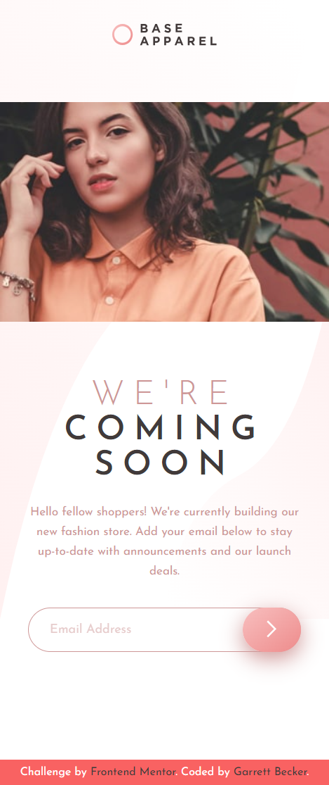
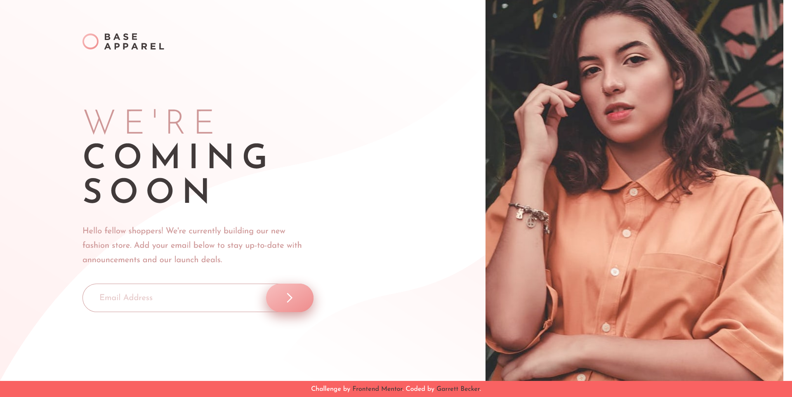

# Frontend Mentor - Base Apparel Coming Soon Page Solution

This is my solution to the [Base apparel coming soon page challenge on Frontend Mentor](https://www.frontendmentor.io/challenges/base-apparel-coming-soon-page-5d46b47f8db8a7063f9331a0). I'm super thankful to have found Frontend Mentor as a great way to confidently grow in my coding skills with real-life projects. 

## Table of contents

- [Frontend Mentor - Base Apparel Coming Soon Page Solution](#frontend-mentor---base-apparel-coming-soon-page-solution)
	- [Table of contents](#table-of-contents)
	- [Overview](#overview)
		- [Project Brief](#project-brief)
		- [Mobile View](#mobile-view)
		- [Desktop View](#desktop-view)
		- [Links](#links)
	- [My process](#my-process)
		- [Built with](#built-with)
		- [What I learned](#what-i-learned)
		- [Continued development](#continued-development)
		- [Useful resources](#useful-resources)
	- [Author](#author)
	- [Acknowledgments](#acknowledgments)

## Overview

### [Project Brief](./project%20brief/)

Your challenge is to build out this coming soon page and get it looking as close to the design as possible.

You can use any tools you like to help you complete the challenge. So if you've got something you'd like to practice, feel free to give it a go.

Your users should be able to:

- View the optimal layout for the site depending on their device's screen size
- See hover states for all interactive elements on the page
- Receive an error message when the `form` is submitted if:
  - The `input` field is empty
  - The email address is not formatted correctly

Want some support on the challenge? [Join our community](https://www.frontendmentor.io/community) and ask questions in the **#help** channel.

### Mobile View



### Desktop View



### Links

- [Solution URL](https://www.frontendmentor.io/solutions/base-apparel-page-with-html-css-KRIlBZ-PMQ)
- [Live Site URL](https://base-apparel-coming-soon-page-gdbecke.netlify.app/)

## My process

### Built with

- HTML5
- CSS3
- JavaScript
- Mobile-first workflow
- [VS Code](https://code.visualstudio.com)

### What I learned

This Base Apparel page was deceptively challenging for a Newbie project and I'm thankful for that - sometimes you need that extra push to test your assumptions or the initial route you thought you were going to take. The biggest challenges were in figuring out the structure with the image on the side: use an 'after' pseudo selector for the body? Add it in as a hard-coded element on the page? What was the best way to position/size the 'before' pseudo selector for the background image? On top of that was the email input form and adding in the custom error message and icon. I settled on structuring the side image as a block element because that was more clear to me to structure and style, and I had to play around with the positioning an styling for the background image until I was happy enough with how it looked on desktop and mobile. The form input is positioned relative so I could absolutely position the error icon on top of the field; I thought that worked best to get the look right. I also went ahead and added a success message when everything goes well on the form for a better UI experience. Happy with how this turned out! I definitely want to keep building more projects with the basic HTML, CSS, and JavaScript tools like in this one.

Here are a few code samples from this project:

```html
<!-- Form section structure -->
<div class="form-row">
	<input class="" type="text" placeholder="Email Address">
	
	<button>
		
	</button>
</div>
<p class="message hidden" id="error-message">Please provide a valid email</p>
<p class="message hidden" id="success-message">Success! We will be in touch soon</p>
```

```css
/* Form styling selection */
#error-icon {
	position: absolute;
	right: 110px;
	top: 15px;
}

.form-row button {
	position: absolute;
	height: 55px;
	right: 0;
	text-align: center;
	border: none;
	border-radius: 30px;
	padding: 1.1rem 2.5rem;
	cursor: pointer;
	background: linear-gradient(to bottom right, hsl(0, 80%, 86%), hsl(0, 74%, 74%));
	box-shadow: var(--desaturatedred) 0px 8px 24px;
}

.form-row button:hover {
	background: linear-gradient(to bottom right, hsl(0, 100%, 98%), hsl(0, 80%, 86%));
}
```

```javascript
// Form button event listener
btn.addEventListener('click', () => {
	const valid = validateEmail(input.value);
	
	if (input.value === '' || input.value === undefined || !validateEmail(input.value)) {
		input.classList.add('error');
		errorIcon.classList.remove('hidden');
		errorMessage.classList.remove('hidden');
		successMessage.classList.add('hidden');
	} else {
		input.classList.remove('error');
		input.classList.add('success');
		errorIcon.classList.add('hidden');
		errorMessage.classList.add('hidden');
		successMessage.classList.remove('hidden');

		input.value = '';
	}
});
```

### Continued development

As a starter developer, I want to keep growing in working as a team and learning how to deliver smaller packages of code at a time, such as components like this one. I thought this project was a good way to get back into vanilla HTML, CSS, and JavaScript and begin doing just that!

### Useful resources

- [CSS Formatter](http://www.lonniebest.com/FormatCSS/) - I found this helpful site when I'm feeling lazy and don't want to format my CSS code, I can have this do it for me, especially putting everything in alphabetical order.
- Brad Traversy's [50 Projects In 50 Days - HTML, CSS & JavaScript course on Udemy](https://www.udemy.com/course/50-projects-50-days/) - I highly recommend this course for great practice in using just HTML, CSS, and vanilla JavaScript to build amazing projects.

## Author

- Website - [Garrett Becker]()
- Frontend Mentor - [@gdbecker](https://www.frontendmentor.io/profile/gdbecker)
- LinkedIn - [Garrett Becker](https://www.linkedin.com/in/garrett-becker-923b4a106/)

## Acknowledgments

Thank you to the Frontend Mentor team for providing all of these fantastic projects to build, and for our getting to help each other grow!