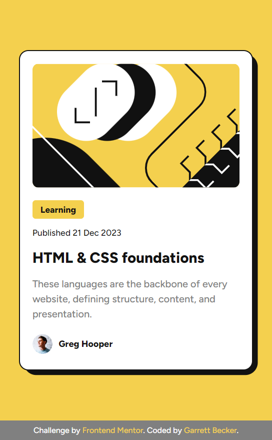

# Frontend Mentor - Blog Preview Card Solution

This is my solution to the [Blog preview card challenge on Frontend Mentor](https://www.frontendmentor.io/challenges/blog-preview-card-ckPaj01IcS). I'm super thankful to have found Frontend Mentor as a great way to confidently grow in my coding skills with real-life projects. 

## Table of contents

- [Frontend Mentor - Blog Preview Card Solution](#frontend-mentor---blog-preview-card-solution)
	- [Table of contents](#table-of-contents)
	- [Overview](#overview)
		- [Project Brief](#project-brief)
		- [Mobile View](#mobile-view)
		- [Desktop View](#desktop-view)
		- [Links](#links)
	- [My process](#my-process)
		- [Built with](#built-with)
		- [What I learned](#what-i-learned)
		- [Continued development](#continued-development)
		- [Useful resources](#useful-resources)
	- [Author](#author)
	- [Acknowledgments](#acknowledgments)

## Overview

### [Project Brief](./project%20brief/)

Your challenge is to build out this blog preview card and get it looking as close to the design as possible.

You can use any tools you like to help you complete the challenge. So if you've got something you'd like to practice, feel free to give it a go.

Your users should be able to:

- See hover and focus states for all interactive elements on the page

Want some support on the challenge? [Join our community](https://www.frontendmentor.io/community) and ask questions in the **#help** channel.

### Mobile View



### Desktop View


### Links

- [Solution URL](https://www.frontendmentor.io/solutions/blog-preview-card-with-html-css-zn9wxN9Jjz)
- [Live Site URL](https://blog-preview-card-gdbecker.netlify.app)

## My process

### Built with

- HTML5
- CSS3
- Mobile-first workflow
- [VS Code](https://code.visualstudio.com)

### What I learned

This was another great simple HTML/CSS challenge take on without any frameworks but opting to focus on the tools themselves - I enjoyed figuring this one out! Since I don't have access to the Figma files, it was helpful to have at least the paragraph text size as the base to configure the rest of the sizing and their proportions to each other. The toughest part was getting the card background styling, and I decided to use an ::after pseudo selector to get some practice using that. I played around with it quite a bit to get the positioning and z-index like I wanted and I'm happy with how it turned out. I definitely want to keep practicing using the basic tools in more projects like this one.

Here are a few code samples from this project:

```html
<!-- HTML Card Structure -->
<div class="card">
	

	<p class="type">Learning</p>
	<p class="published">Published 21 Dec 2023</p>
	<h1 class="title">HTML & CSS foundations</h1>
	<p class="description">These languages are the backbone of every website, defining structure, content, and presentation.</p>

	<div class="card-footer">
		
		<h2 class="name">Greg Hooper</h2>
	</div>
</div>
```

```css
/* Card CSS with background pseudo element */
.card {
	display: flex;
	flex-direction: column;
	color: var(--black);
	width: 375px;
	background-color: var(--white);
	padding: 1.25rem;
	text-align: left;
	border-radius: 15px;
	border: 2px solid var(--black);
}

.card::after {
	content: '';
	background-color: var(--black);
	width: 375px;
	height: 515px;
	position: absolute;
	border-radius: 20px;
	z-index: -1;
	translate: -14px -15px;
}
```

### Continued development

As a starter developer, I want to keep growing in working as a team and learning how to deliver smaller packages of code at a time, such as components like this one. I thought this project was a good way to get back into React and begin doing just that!

### Useful resources

- [CSS Formatter](http://www.lonniebest.com/FormatCSS/) - I found this helpful site when I'm feeling lazy and don't want to format my CSS code, I can have this do it for me, especially putting everything in alphabetical order.
- Brad Traversy's [50 Projects In 50 Days - HTML, CSS & JavaScript course on Udemy](https://www.udemy.com/course/50-projects-50-days/) - I highly recommend this course for great practice in using just HTML, CSS, and vanilla JavaScript to build amazing projects.

## Author

- Website - [Garrett Becker]()
- Frontend Mentor - [@gdbecker](https://www.frontendmentor.io/profile/gdbecker)
- LinkedIn - [Garrett Becker](https://www.linkedin.com/in/garrett-becker-923b4a106/)

## Acknowledgments

Thank you to the Frontend Mentor team for providing all of these fantastic projects to build, and for our getting to help each other grow!