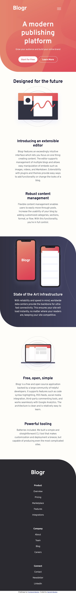
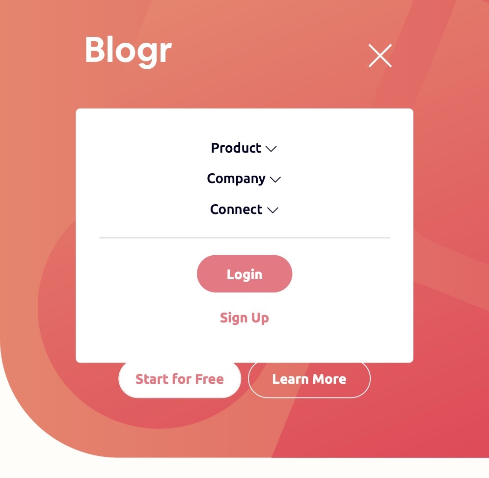

# Frontend Mentor - Blogr Landing Page Solution

This is my solution to the [Blogr landing page challenge on Frontend Mentor](https://www.frontendmentor.io/challenges/blogr-landing-page-EX2RLAApP). I'm super thankful to have found Frontend Mentor as a great way to confidently grow in my coding skills with real-life projects. 

## Table of contents

- [Overview](#overview)
  - [Project Brief](#project-brief)
  - [Mobile View](#mobile-view)
  - [Mobile View with Menu](#mobile-view-with-menu)
  - [Desktop View](#desktop-view)
  - [Links](#links)
- [My process](#my-process)
  - [Built with](#built-with)
  - [What I learned](#what-i-learned)
  - [Continued development](#continued-development)
  - [Useful resources](#useful-resources)
- [Author](#author)
- [Acknowledgments](#acknowledgments)

## Overview

### [Project Brief](./project%20brief/)

Your challenge is to build out this landing page and get it looking as close to the design as possible.

You can use any tools you like to help you complete the challenge. So if you've got something you'd like to practice, feel free to give it a go.

Your users should be able to:

- View the optimal layout for the site depending on their device's screen size
- See hover states for all interactive elements on the page

Want some support on the challenge? [Join our Slack community](https://www.frontendmentor.io/slack) and ask questions in the **#help** channel.

### Mobile View



### Mobile View with Menu



### Desktop View


### Links

- [Solution URL](https://www.frontendmentor.io/solutions/blogr-landing-page-with-react-bootstrap-ziqxnxrt9z)
- [Live Site URL](https://blogr-homepage-gdbecker.netlify.app)

## My process

### Built with

- [React](https://reactjs.org/) - JS library
- HTML5
- CSS
- Bootstrap
- Mobile-first workflow
- [VS Code](https://code.visualstudio.com)

### What I learned

Blogr's landing page took me longer than I anticipated, but it was a really good challenge for me to keep persevering through the difficulties. As I was going section by section and breaking down the design problem into parts, I quickly realized how tricky getting the images right would be - I think in general this is something I want to keep working on. Because there are many ways to format image content, it took me some time flipping between loading in the picture as a component and then positioning, or using it as a background and then adjust size, position, and so on. Plus I had to keep the mobile view and desktop views in mind while I worked, and that was good practice for me to make sure that the choices I made could be spread across both as much as possible.

Navbars in general are also an area I'm learning so much more about and want to keep growing in - that's part of why I'm thankful for these realistic project scenarios because of the varied designs. The trickiest part with this navbar was to get the mobile menu and arrow signs across dekstop and mobile to flip like I wanted. I also figured out a way to flip the arrow back even if a user clicks outside of the menu link. After a whole lot of tinkering I'm happy with the result!

Here are a few code samples from this project:

```html
<li ref={menuRefProduct}>
  <DropdownButton
    key="down-centered"
    drop="down-centered"
    title={product}
    id="dropdown"
    onClick={e => onProductClick(e)}
  >
    <Dropdown.Item href="/">Overview</Dropdown.Item>
    <Dropdown.Item href="/">Pricing</Dropdown.Item>
    <Dropdown.Item href="/">Marketplace</Dropdown.Item>
    <Dropdown.Item href="/">Features</Dropdown.Item>
    <Dropdown.Item href="/">Integrations</Dropdown.Item>
    
  </DropdownButton>
</li>
```

```css
@media(max-width: 1000px) {

  .nav-wrapper {
    background-color: #FFFFFF;
    border-radius: 5px;
    color: #00001A;
    justify-content: center;
    left: 0;
    padding: 7%;
    position: absolute;
    right: 0;
    text-align: center;
    top: 100px;
  }

  #dropdown {
    align-items: center;
    justify-content: center;
  }

  #dropdown {
    color: #00001A !important;
    margin: 0 !important;
  }
  
  #dropdown:hover {
    font-family: Ubuntu-Bold;
    text-decoration: underline;
  }

  .dropdown-menu {
    border: 0 !important;
    border-radius: 0 !important;
    margin-bottom: 3rem !important;
    margin-top: -10% !important;
    position: relative !important;
    width: 100%;
  }

  .dropdown-item {
    background-color: #DBDBDB !important;
    font-family: Ubuntu-Light;
    font-size: 14px;
    margin-left: auto !important;
    margin-right: auto !important;
    position: relative !important;
    text-align: center !important;
  }
  
  .dropdown-item:hover {
    background-color: #DBDBDB !important;
    font-family: Ubuntu-Medium;
  }
}
```

```js
 useEffect(() => {
  let handler = (e)=> {
    if(!menuRefProduct.current.contains(e.target)){
      setOpenProduct(false);
      console.log(menuRefProduct.current);
    }
    
    if(!menuRefCompany.current.contains(e.target)){
      setOpenCompany(false);
      console.log(menuRefCompany.current);
    }

    if(!menuRefConnect.current.contains(e.target)){
      setOpenConnect(false);
      console.log(menuRefConnect.current);
    }
  };

  document.addEventListener("mousedown", handler);
  
  return() =>{
    document.removeEventListener("mousedown", handler);
  }
});
```

### Continued development

As a starter developer, I want to keep growing in working as a team and learning how to deliver robust and beautiful solutions like this one. I thought this project was a good way to get back into React and begin doing just that!

### Useful resources

- [CSS Formatter](http://www.lonniebest.com/FormatCSS/) - I found this helpful site when I'm feeling lazy and don't want to format my CSS code, I can have this do it for me, especially putting everything in alphabetical order.
- [HSL to HEX Color Converter](https://htmlcolors.com/hsl-to-hex) - For a few of my Frontend Mentor projects I liked to convert the HSL into HEX codes just because I was more familiar with those, and this site was a handy link I had on hand to accomplish that
- [CSS Box Shadows](https://getcssscan.com/css-box-shadow-examples) - These are a helpful set of box-shadow styles with a wide variety of styles. This is one of those settings I'm coming to grips with so this is a great way to find one to start off with and then modify as needed.

## Author

- Website - [Garrett Becker]()
- Frontend Mentor - [@gdbecker](https://www.frontendmentor.io/profile/gdbecker)
- LinkedIn - [Garrett Becker](https://www.linkedin.com/in/garrett-becker-923b4a106/)

## Acknowledgments

Thank you to the Frontend Mentor team for providing all of these fantastic projects to build, and for our getting to help each other grow!