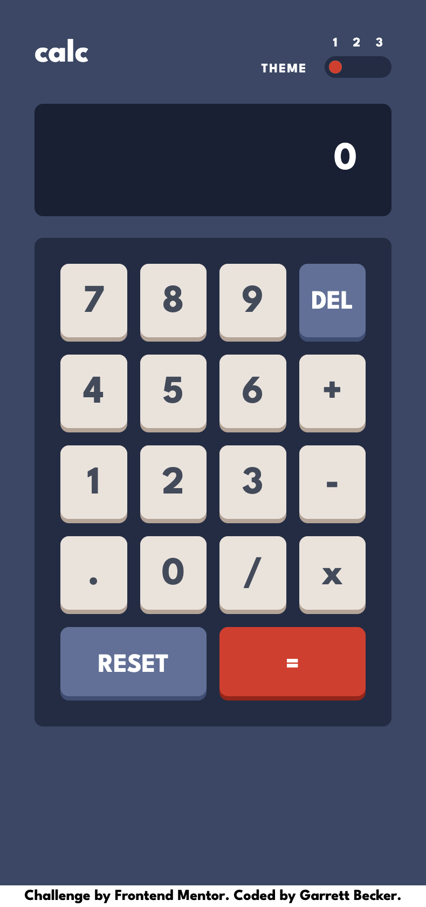
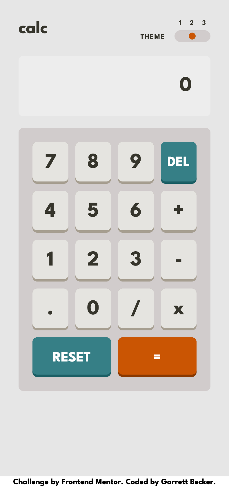
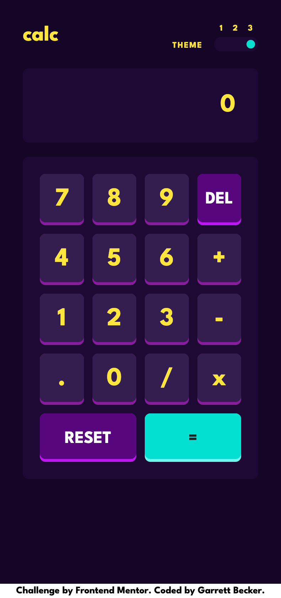
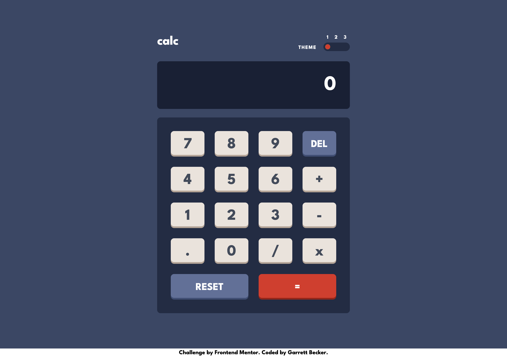
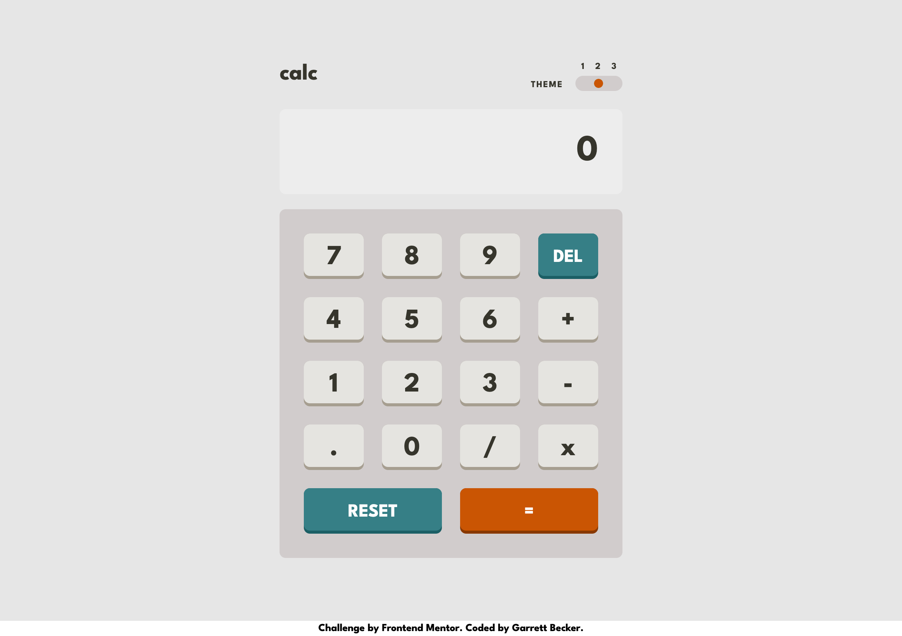
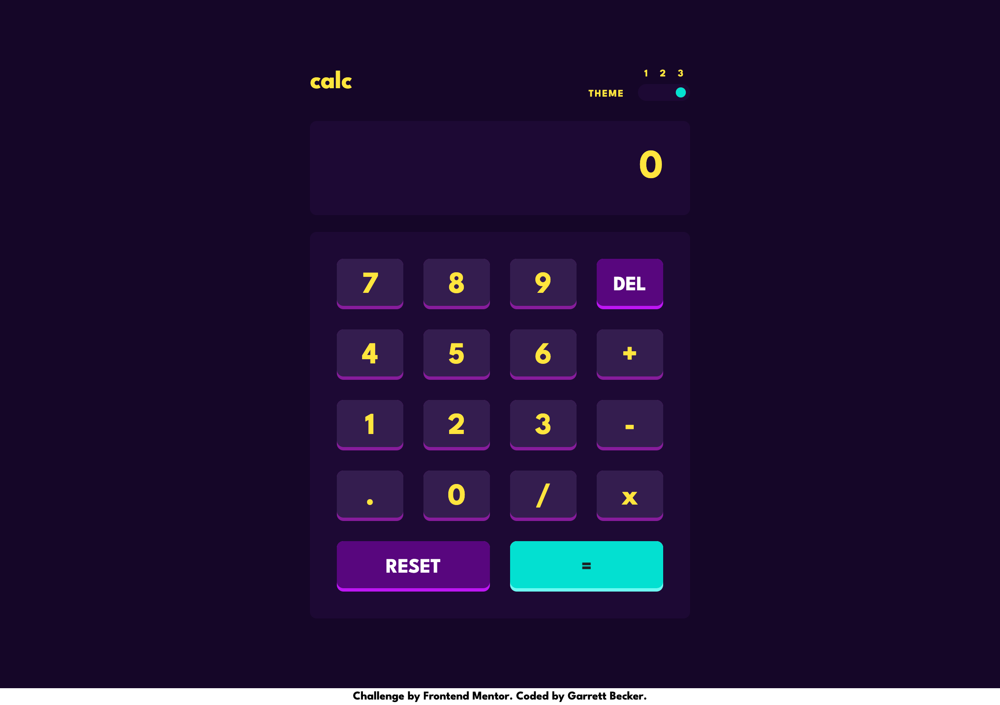

# Frontend Mentor - Calculator App Solution

This is my solution to the [Calculator app challenge on Frontend Mentor](https://www.frontendmentor.io/challenges/calculator-app-9lteq5N29). I'm super thankful to have found Frontend Mentor as a great way to confidently grow in my coding skills with real-life projects. 

## Table of contents

- [Frontend Mentor - Calculator App Solution](#frontend-mentor---calculator-app-solution)
	- [Table of contents](#table-of-contents)
	- [Overview](#overview)
		- [Project Brief](#project-brief)
		- [Mobile Views](#mobile-views)
			- [Theme One](#theme-one)
			- [Theme Two](#theme-two)
			- [Theme Three](#theme-three)
		- [Desktop Views](#desktop-views)
			- [Theme One](#theme-one-1)
			- [Theme Two](#theme-two-1)
			- [Theme Three](#theme-three-1)
		- [Links](#links)
	- [My process](#my-process)
		- [Built with](#built-with)
		- [What I learned](#what-i-learned)
		- [Continued development](#continued-development)
		- [Useful resources](#useful-resources)
	- [Author](#author)
	- [Acknowledgments](#acknowledgments)

## Overview

### [Project Brief](./project%20brief/)

Your challenge is to build out this calculator app and get it looking as close to the design as possible.

You can use any tools you like to help you complete the challenge. So if you've got something you'd like to practice, feel free to give it a go.

Your users should be able to:

- See the size of the elements adjust based on their device's screen size
- Perform mathematical operations like addition, subtraction, multiplication, and division
- Adjust the color theme based on their preference
- **Bonus**: Have their initial theme preference checked using `prefers-color-scheme` and have any additional changes saved in the browser

Want some support on the challenge? [Join our Slack community](https://www.frontendmentor.io/slack) and ask questions in the **#help** channel.

### Mobile Views

#### Theme One


#### Theme Two


#### Theme Three


### Desktop Views

#### Theme One


#### Theme Two


#### Theme Three


### Links

- [Solution URL](https://www.frontendmentor.io/solutions/calculator-app-with-next-tailwind-YnS4hyZBDm)
- [Live Site URL](https://calculator-gdbecker.netlify.app)

## My process

### Built with

- [React](https://reactjs.org/) - JS library
- [Next.js](https://nextjs.org) - React framework
- HTML5
- CSS
- [Tailwind CSS](https://tailwindcss.com) - CSS framework
- Mobile-first workflow
- [VS Code](https://code.visualstudio.com)

### What I learned

This calculator challenge was a really good one because it tested not just my CSS skills with Tailwind, but also pushed me to persevere and keep going even when it got tough. The grid layout for the entire page was the simplest part for me, as well as using the Tailwind grid classes to control button sizes and widths, such as for the Reset and Delete buttons at the bottom, or spanning the viewbox at the top. I enjoyed getting the button shadows and movement right when you clicked on one. It was satisfying to see it play out exactly like I envisioned.

Where it got challenging was in controlling the calculations and the finer details I missed at first (such as when an operand was already selected) and controlling the theme switcher. Managing the four main operands wasn't the tricky part, but it was making sure I was capturing the different states - like when you want to keep using the same string of operations going by selecting another operand, or hitting delete to back up a digit that was typed, or making sure the rounding was correct. All of these were great sub-challenges that came up as I worked and tackled one at a time. For the theme switcher, covering all the colors I would need for the different screen components wasn't bad, but I had to play around with how I organized all of these variables in the backend. At first I created separate Tailwind color variables in the config file, but that was definitely cluttering up my HTML further with extra classes to catch when the theme was one, two, or three. What I ended up going with was creating blocks of styles in globals.css to decide what the color would be for each color variable based on the selected theme. I used ThemeProvider from Next and a state variable to catch when the theme was changed, storing the chosen theme as a LocalStorage variable which would be read in automatically the next time you visited the page. The gotcha moment for me was making sure that I set up the theme to the first one for the initial page load, otherwise no theme would be set and the page would be entirely white. 

I had a great time with this project and am very happy with the result, both on mobile and larger screens. I definitely want to keep practicing using themes, grids, animation and other styles and functions with Next and Tailwind!

Here are a few code samples from this project:

```html
<!-- Calculator screen structure -->
<div className="flex flex-row justify-end bg-th-ScreenBg mt-6 p-8 rounded-lg">
	<h1 className="flex text-th-TextHeader text-4xl md:text-5xl">{ screenNum }</h1>
</div>
```

```css
/* Theme colors when Theme One was selected */
[data-theme="one"] {
  --MainBg: hsl(222, 26%, 31%);
  --KeypadBg: hsl(223, 31%, 20%);
  --ScreenBg: hsl(224, 36%, 15%);

  --KeyEditBg: hsl(225, 21%, 49%);
  --KeyEditBgHover: hsl(225, 21%, 70%);
  --KeyEditShadow: hsl(224, 28%, 35%);
  --KeyEqualsBg: hsl(6, 63%, 50%);
  --KeyEqualsBgHover: hsl(6, 63%, 75%);
  --KeyEqualsShadow: hsl(6, 70%, 34%);
  --KeyMainBg: hsl(30, 25%, 89%);
  --KeyMainBgHover: hsl(30, 25%, 99%);
  --KeyMainShadow: hsl(28, 16%, 65%);

  --TextHeader: hsl(0, 0%, 100%);
  --TextMainBtn: hsl(221, 14%, 31%);
  --TextEditBtn: hsl(0, 0%, 100%);
  --TextEqualsBtn: hsl(0, 0%, 100%);   

  --TextDark: hsl(221, 14%, 31%);
  --TextWhite: hsl(0, 0%, 100%);
}
```

```js
// Main math control function
const doMath = () => {
	var solution = 0;

	if (operand == "+") {
		solution = parseFloat(nextNum) + parseFloat(screenNum);
	} else if (operand == "-") {
		solution = parseFloat(nextNum) - parseFloat(screenNum);
	} else if (operand == "x") {
		solution = parseFloat(nextNum) * parseFloat(screenNum);
	} else if (operand == "/") {
		solution = parseFloat(nextNum) / parseFloat(screenNum);
	}

	return Math.round(solution * 100000) / 100000
}
```

### Continued development

As a starter developer, I want to keep growing in working as a team and learning how to deliver smaller packages of code at a time, such as robust and beautiful pages like this one. I thought this project was a good way to get back into Next.js and begin doing just that!

### Useful resources

- [next-themes ThemeProvider](https://github.com/pacocoursey/next-themes) - Github repo for ThemeProvider from next-themes. This was a built-in component I used for controlling more than two themes for this challenge.
- [Tailwind Grid](https://tailwindcss.com/docs/grid-template-columns) - Handy guide from Tailwind's docs about using grid-cols to structure content

## Author

- Website - [Garrett Becker]()
- Frontend Mentor - [@gdbecker](https://www.frontendmentor.io/profile/gdbecker)
- LinkedIn - [Garrett Becker](https://www.linkedin.com/in/garrett-becker-923b4a106/)

## Acknowledgments

Thank you to the Frontend Mentor team for providing all of these fantastic projects to build, and for our getting to help each other grow!