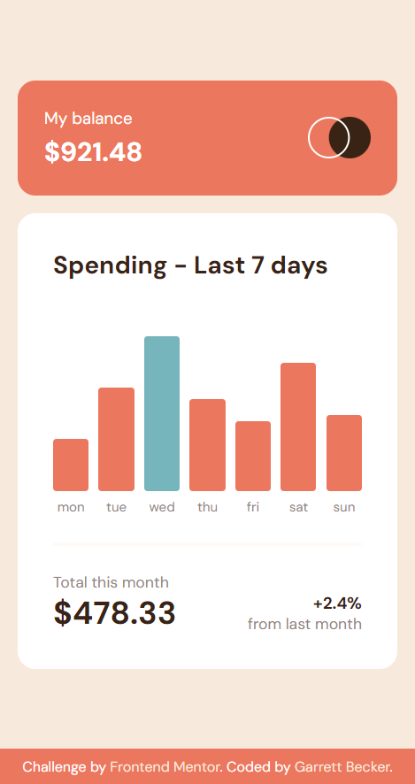
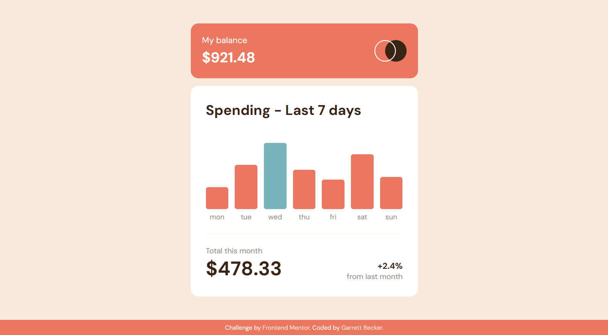

# Frontend Mentor - Expenses Chart Component Solution

This is my solution to the [Expenses chart component challenge on Frontend Mentor](https://www.frontendmentor.io/challenges/expenses-chart-component-e7yJBUdjwt). I'm super thankful to have found Frontend Mentor as a great way to confidently grow in my coding skills with real-life projects. 

## Table of contents

- [Frontend Mentor - Expenses Chart Component Solution](#frontend-mentor---expenses-chart-component-solution)
	- [Table of contents](#table-of-contents)
	- [Overview](#overview)
		- [Project Brief](#project-brief)
		- [Mobile View](#mobile-view)
		- [Desktop View](#desktop-view)
		- [Links](#links)
	- [My process](#my-process)
		- [Built with](#built-with)
		- [What I learned](#what-i-learned)
		- [Continued development](#continued-development)
		- [Useful resources](#useful-resources)
	- [Author](#author)
	- [Acknowledgments](#acknowledgments)

## Overview

### [Project Brief](./project%20brief/)

Your challenge is to build out this bar chart component and get it looking as close to the design as possible.

You can use any tools you like to help you complete the challenge. So if you've got something you'd like to practice, feel free to give it a go.

We provide the data for the chart in a local `data.json` file. So you can use that to dynamically add the bars if you choose.

Your users should be able to:

- View the bar chart and hover over the individual bars to see the correct amounts for each day
- See the current day's bar highlighted in a different colour to the other bars
- View the optimal layout for the content depending on their device's screen size
- See hover states for all interactive elements on the page
- **Bonus**: See dynamically generated bars based on the data provided in the local JSON file

Want some support on the challenge? [Join our community](https://www.frontendmentor.io/community) and ask questions in the **#help** channel.

### Mobile View



### Desktop View



### Links

- [Solution URL](https://www.frontendmentor.io/solutions/expenses-chart-component-with-html-css-javascript-UBH4GcyB5Z)
- [Live Site URL](https://expenses-chart-component-gdbecker.netlify.app)

## My process

### Built with

- HTML5
- CSS3
- JavaScript
- Mobile-first workflow
- [VS Code](https://code.visualstudio.com)

### What I learned

I really liked this challenge with all the details to figure out as I went. Focused first on the overall design/look for the component and matching up to the requirements as closely as possible, so manually putting in the bars and cyan color for today's day of the week. After that I dove into the JavaScript to add the needed bits of functionality as well as the bonus: dynamically style the bars' height based on provided .json data. Adding the cyan background color wasn't bad as I used the built-in functions to get the index of today's weekday and then grabbed the day name from my own array. Having the dollar amount appear on hover was a bit tricky, but I settled on removing my 'hidden' class on hovering over a bar, finding the amount box by using 'previousElementSibling'. After that was calculating each of the bars' height and I tackled it by first finding the max value, then finding what the bar's height in px should be based on the ratio of the bar's amount to the max amount - just a bit of high school math. Happy with how this turned out! I definitely want to keep practicing using the basic tools in more projects like this one.

Here are a few code samples from this project:

```html
<!-- Graph structure -->
<div id="graph" class="graph">
	<div id="mon" class="day">
		<p class="amount hidden"></p>
		<div class="bar"></div>
		<p class="label">mon</p>
	</div>
	<div id="tue" class="day">
		<p class="amount hidden"></p>
		<div class="bar"></div>
		<p class="label">tue</p>
	</div>
	<div id="wed" class="day">
		<p class="amount hidden"></p>
		<div class="bar"></div>
		<p class="label">wed</p>
	</div>
	<div id="thu" class="day">
		<p class="amount hidden"></p>
		<div class="bar"></div>
		<p class="label">thu</p>
	</div>
	<div id="fri" class="day">
		<p class="amount hidden"></p>
		<div class="bar"></div>
		<p class="label">fri</p>
	</div>
	<div id="sat" class="day">
		<p class="amount hidden"></p>
		<div class="bar"></div>
		<p class="label">sat</p>
	</div>
	<div id="sun" class="day">
		<p class="amount hidden"></p>
		<div class="bar"></div>
		<p class="label">sun</p>
	</div>
</div>
```

```css
/* Dollar amounts and bars styling */
.amount {
	position: absolute;
	top: -57px;
	left: -9px;
	font-weight: 700;
	font-size: 15px;
	background-color: var(--darkbrown);
	color: var(--white);
	padding: 0.45rem 0.5rem;
	border-radius: 5px;
	width: 67px;
	text-align: center;
	z-index: 10;
}

.bar {
	height: 140px;
	background-color: var(--softred);
	border-radius: 5px;
	cursor: pointer;
	margin-bottom: 0.4rem;
}

.bar.today {
	background-color: var(--cyan);
}

.bar:hover {
	opacity: 0.5;
}
```

```js
// Dynamically styling bars based on .json data
bars.forEach(bar => {
	// Mouse enter/leave to show dollar amounts
	bar.addEventListener('mouseenter', () => {
		bar.previousElementSibling.classList.remove('hidden');
	});

	bar.addEventListener('mouseleave', () => {
		bar.previousElementSibling.classList.add('hidden');
	});

	// Adjust bar height depending on dollar amount / max for the week
	const graphHeight = bar.parentElement.parentElement.clientHeight;
	const amt = +bar.previousElementSibling.innerHTML.slice(1);
	const height = (graphHeight * amt)/max;
	bar.style.height = `${height}px`;

	// Assign blue color for today's weekday
	if (bar.parentElement.id === weekdays[today]) {
		bar.classList.add('today');
	}
});
```

### Continued development

As a starter developer, I want to keep growing in working as a team and learning how to deliver smaller packages of code at a time, such as components like this one. I thought this project was a good way to get practice building components with vanilla HTML, CSS, and JavaScript!

### Useful resources

- [CSS Formatter](http://www.lonniebest.com/FormatCSS/) - I found this helpful site when I'm feeling lazy and don't want to format my CSS code, I can have this do it for me, especially putting everything in alphabetical order.
- Brad Traversy's [50 Projects In 50 Days - HTML, CSS & JavaScript course on Udemy](https://www.udemy.com/course/50-projects-50-days/) - I highly recommend this course for great practice in using just HTML, CSS, and vanilla JavaScript to build amazing projects.

## Author

- Website - [Garrett Becker]()
- Frontend Mentor - [@gdbecker](https://www.frontendmentor.io/profile/gdbecker)
- LinkedIn - [Garrett Becker](https://www.linkedin.com/in/garrett-becker-923b4a106/)

## Acknowledgments

Thank you to the Frontend Mentor team for providing all of these fantastic projects to build, and for our getting to help each other grow!