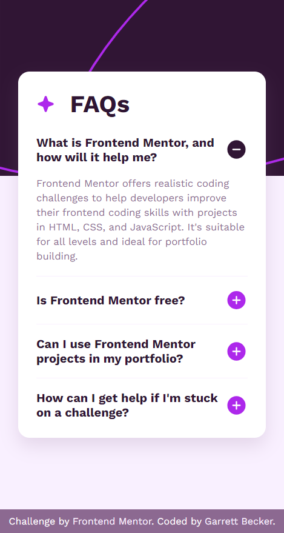

# Frontend Mentor - FAQ Accordion Solution

This is my solution to the [Article preview component challenge on Frontend Mentor](https://www.frontendmentor.io/challenges/faq-accordion-wyfFdeBwBz). I'm super thankful to have found Frontend Mentor as a great way to confidently grow in my coding skills with real-life projects. 

## Table of contents

- [Frontend Mentor - FAQ Accordion Solution](#frontend-mentor---faq-accordion-solution)
	- [Table of contents](#table-of-contents)
	- [Overview](#overview)
		- [Project Brief](#project-brief)
		- [Mobile View](#mobile-view)
		- [Desktop View](#desktop-view)
		- [Links](#links)
	- [My process](#my-process)
		- [Built with](#built-with)
		- [What I learned](#what-i-learned)
		- [Continued development](#continued-development)
		- [Useful resources](#useful-resources)
	- [Author](#author)
	- [Acknowledgments](#acknowledgments)

## Overview

### [Project Brief](./project%20brief/)

Your challenge is to build out this FAQ accordion and get it looking as close to the design as possible.

You can use any tools you like to help you complete the challenge. So if you've got something you'd like to practice, feel free to give it a go.

Your users should be able to: 

- Hide/Show the answer to a question when the question is clicked
- Navigate the questions and hide/show answers using keyboard navigation alone
- View the optimal layout for the interface depending on their device's screen size
- See hover and focus states for all interactive elements on the page

Want some support on the challenge? [Join our community](https://www.frontendmentor.io/community) and ask questions in the **#help** channel.

### Mobile View



### Desktop View


### Links

- [Solution URL]()
- [Live Site URL]()

## My process

### Built with

- HTML5
- CSS3
- JavaScript
- Mobile-first workflow
- [VS Code](https://code.visualstudio.com)

### What I learned

In Brad Traversy's [50 Projects In 50 Days - HTML, CSS & JavaScript Udemy course](https://www.udemy.com/course/50-projects-50-days/) I worked on an FAQ component but I wanted to get more practice making my own with this project, and I'm definitely happy with how it turned out. There were a lot of great little challenges with this one, especially with the top image of the page background, using the provided icons and activating them depending on if the answer is expanded, and of course adding event listeners to the image buttons to expand/collapse. I used a 'before' pseudo selector to add in the top image background and settled on about 1/3 of the screen height, positioning it absolutely on top of the main pink background but beneath the card. The 'hidden' class gets put on the expand/collapse button depending on the state as well as the answer block, changing its display to none or not. For the JavaScript it did get a bit tricky when I was trying to loop through just the buttons that were siblings together inside a question block, but accessing the parentElement and then its children did the trick. I definitely want to keep building more projects with the basic HTML, CSS, and JavaScript tools like in this one.

Here are a few code samples from this project:

```html
<!-- Question block structure -->
<div class="block">
	<div class="question clicked">
		<h2>What is Frontend Mentor, and how will it help me?</h2>
		
		
	</div>
	<div class="answer">
		<p>
			Frontend Mentor offers realistic coding challenges to help developers improve their frontend coding skills with projects in HTML, CSS, and JavaScript. It's suitable for all levels and ideal for portfolio building.
		</p>
	</div>
</div>
```

```css
/* Styles for each question block */
.block:last-child > .question {
	margin-bottom: 0;
}

.question {
	display: flex;
	flex-direction: row;
	align-items: center;
	justify-content: space-between;
	margin: 1.4rem 0;
}

.question.clicked {
	margin: 1.4rem 0 0 0;
}

.question img {
	border: none;
	background-color: transparent;
	cursor: pointer;
}
```

```javascript
// Event listeners for each expand/collapse button
buttons.forEach((button) => {
	button.addEventListener('click', () => {
		let btns = Array.from(button.parentElement.children);
		btns = btns.filter(b => b.localName === 'img');
		btns.forEach(b => b.classList.toggle('hidden'));

		button.parentElement.classList.toggle('clicked');

		const answer = button.parentElement.nextElementSibling.classList.toggle('hidden');
	});
});
```

### Continued development

As a starter developer, I want to keep growing in working as a team and learning how to deliver smaller packages of code at a time, such as components like this one. I thought this project was a good way to get back into React and begin doing just that!

### Useful resources

- [CSS Formatter](http://www.lonniebest.com/FormatCSS/) - I found this helpful site when I'm feeling lazy and don't want to format my CSS code, I can have this do it for me, especially putting everything in alphabetical order.
- Brad Traversy's [50 Projects In 50 Days - HTML, CSS & JavaScript course on Udemy](https://www.udemy.com/course/50-projects-50-days/) - I highly recommend this course for great practice in using just HTML, CSS, and vanilla JavaScript to build amazing projects.

## Author

- Website - [Garrett Becker]()
- Frontend Mentor - [@gdbecker](https://www.frontendmentor.io/profile/gdbecker)
- LinkedIn - [Garrett Becker](https://www.linkedin.com/in/garrett-becker-923b4a106/)

## Acknowledgments

Thank you to the Frontend Mentor team for providing all of these fantastic projects to build, and for our getting to help each other grow!