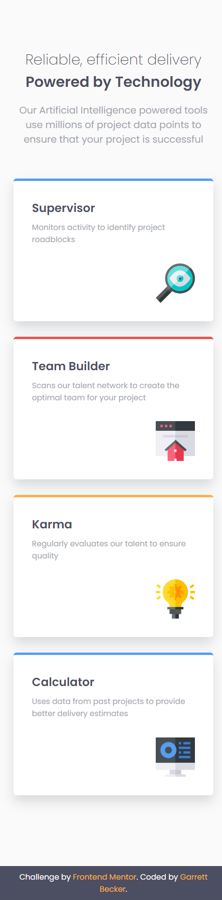

# Frontend Mentor - Four Card Feature Section Solution

This is my solution to the [Four card feature section challenge on Frontend Mentor](https://www.frontendmentor.io/challenges/four-card-feature-section-weK1eFYK). I'm super thankful to have found Frontend Mentor as a great way to confidently grow in my coding skills with real-life projects. 

## Table of contents

- [Frontend Mentor - Four Card Feature Section Solution](#frontend-mentor---four-card-feature-section-solution)
	- [Table of contents](#table-of-contents)
	- [Overview](#overview)
		- [Project Brief](#project-brief)
		- [Mobile View](#mobile-view)
		- [Desktop View](#desktop-view)
		- [Links](#links)
	- [My process](#my-process)
		- [Built with](#built-with)
		- [What I learned](#what-i-learned)
		- [Continued development](#continued-development)
		- [Useful resources](#useful-resources)
	- [Author](#author)
	- [Acknowledgments](#acknowledgments)

## Overview

### [Project Brief](./project%20brief/)

Your challenge is to build out this feature section and get it looking as close to the design as possible.

You can use any tools you like to help you complete the challenge. So if you've got something you'd like to practice, feel free to give it a go.

Your users should:

- View the optimal layout for the site depending on their device's screen size

Want some support on the challenge? [Join our community](https://www.frontendmentor.io/community) and ask questions in the **#help** channel.

### Mobile View



### Desktop View


### Links

- [Solution URL](https://www.frontendmentor.io/solutions/four-card-feature-section-with-html-css-SZBaeKV0w8)
- [Live Site URL](https://four-card-feature-section-gdbecker.netlify.app/)

## My process

### Built with

- HTML5
- CSS3
- Mobile-first workflow
- [VS Code](https://code.visualstudio.com)

### What I learned

This was a great challenge for using layouts and I'm glad to keep getting practice. I settled on using flex boxes for the main page content with cards: using a flex row on desktop screens which switches to column on mobile, and I used three columns to house the cards. Utilizing align-items to the center got the desired effect needed, and from there I styled the cards to get them as close as possible to the design. I definitely want to keep building more projects with the basic HTML, CSS, and JavaScript tools like in this one.

Here are a few code samples from this project:

```html
<!-- Card structure -->
<div class="card" id="team-builder">
	<div class="card-header">
		<h3>Team Builder</h3>
		<p>Scans our talent network to create the optimal team for your project</p>
	</div>
	<div class="card-img">
		
	</div>
</div>
```

```css
/* Card styling */
.card {
	display: flex;
	flex-direction: column;
	justify-content: space-between;
	color: var(--darkblue);
	width: 350px;
	height: 250px;
	background-color: var(--white);
	text-align: left;
	border-radius: 5px;
	box-shadow: var(--boxshadow) 0px 10px 20px;
	padding: 1.9rem;
	margin: 0.8rem 0;
}

.card h3 {
	margin: 0;
	color: var(--darkblue);
	font-size: 1.3rem;
}

.card p {
	margin: 0;
	margin-top: 0.5rem;
	color: var(--grayishblue);
	font-size: 0.85rem;
}
```

### Continued development

As a starter developer, I want to keep growing in working as a team and learning how to deliver smaller packages of code at a time, such as components like this one. I thought this project was a good way to get back into React and begin doing just that!

### Useful resources

- [CSS Formatter](http://www.lonniebest.com/FormatCSS/) - I found this helpful site when I'm feeling lazy and don't want to format my CSS code, I can have this do it for me, especially putting everything in alphabetical order.
- Brad Traversy's [50 Projects In 50 Days - HTML, CSS & JavaScript course on Udemy](https://www.udemy.com/course/50-projects-50-days/) - I highly recommend this course for great practice in using just HTML, CSS, and vanilla JavaScript to build amazing projects.

## Author

- Website - [Garrett Becker]()
- Frontend Mentor - [@gdbecker](https://www.frontendmentor.io/profile/gdbecker)
- LinkedIn - [Garrett Becker](https://www.linkedin.com/in/garrett-becker-923b4a106/)

## Acknowledgments

Thank you to the Frontend Mentor team for providing all of these fantastic projects to build, and for our getting to help each other grow!