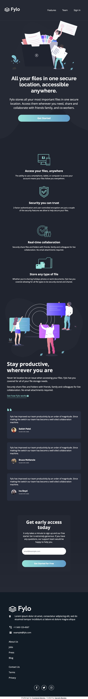

# Frontend Mentor - Fylo Dark Theme Landing Page Solution

This is my solution to the [[Fylo dark theme landing page challenge on Frontend Mentor](https://www.frontendmentor.io/challenges/fylo-dark-theme-landing-page-5ca5f2d21e82137ec91a50fd). I'm super thankful to have found Frontend Mentor as a great way to confidently grow in my coding skills with real-life projects. 

## Table of contents

- [Overview](#overview)
  - [Project Brief](#project-brief)
  - [Mobile View](#mobile-view)
  - [Desktop View](#desktop-view)
  - [Links](#links)
- [My process](#my-process)
  - [Built with](#built-with)
  - [What I learned](#what-i-learned)
  - [Continued development](#continued-development)
  - [Useful resources](#useful-resources)
- [Author](#author)
- [Acknowledgments](#acknowledgments)

## Overview

### [Project Brief](./project%20brief/)

Your challenge is to build out this landing page and get it looking as close to the design as possible.

You can use any tools you like to help you complete the challenge. So if you've got something you'd like to practice, feel free to give it a go.

Your users should be able to: 

- View the optimal layout for the site depending on their device's screen size
- See hover states for all interactive elements on the page

Want some support on the challenge? [Join our Slack community](https://www.frontendmentor.io/slack) and ask questions in the **#help** channel.

### Mobile View




### Desktop View


### Links

- [Solution URL]()
- [Live Site URL](https://fylo-landing-dark-gdbecker.netlify.app)

## My process

### Built with

- [React](https://reactjs.org/) - JS library
- [Next.js](https://nextjs.org) - React framework
- HTML5
- CSS
- [SASS](https://sass-lang.com) - CSS extension language
- Bootstrap
- Mobile-first workflow
- [VS Code](https://code.visualstudio.com)

### What I learned

After working on a couple of landing pages with React and Bootstrap, I wanted to try using Next.js to create one - I appreciated having a simpler navbar for this one! One of the main challenges I came across was getting more familiar with client-side vs server-side rendering, as I often ran into the "hydration" error if I was attempting to use functionality within SSR that was reserved for CSR. I was able to resolve these as I kept tinkering and figuring out what worked best, and as I was using an on-load Bootstrap JS library as well as submitting a form, I decided to make the main landing page use CSR. A challenge for myself in the future is to only use SSR to make the page work. Overall, this project gave me more great practice for making responsive layouts and challenged me on background image positioning, especially in the top intro section.

Here are a few code samples from this project:

```html
<div className="row mt-2">
  <form onSubmit={e => onSubmit(e)}>
    <div className="row mt-1">
      <div className="col-md-8">
        <div className="form-group">
          <input
            className='form-control register-input'
            type='text'
            placeholder='email@example.com'
            id="year"
            name='year'
            value={formEmail}
            onChange={e => onChange(e)}
            required
          />
          <label className='register-form register-error' htmlFor="day">{formError}</label>
        </div>
      </div>
      <div className="col-md-4">
        <div className="form-group">
          <button 
            className="register-button" 
            type="submit">Get Started for Free</button>
        </div>
      </div>
    </div>
  </form>
</div>
```

```css
.register-button {
  background: linear-gradient(to right, $cyan, $blue);
	border: 0px !important;
	border-radius: 35px;
	box-shadow: none !important;
	color: $white;
	font-family: $OpenSans-Bold;
	font-size: 0.8rem;
	min-height: 45px;
	outline: none !important;
	padding-bottom: auto !important;
	padding-top: auto !important;
	width: 100% !important;
}

.register-button:hover {
  background: $lightBlue;
}

.register-error {
  color: $lightRed;
  font-size: 0.65rem;
  text-align: left !important;
}
```

```js
const onSubmit = async (e) => {
  e.preventDefault();

  var validRegex = /^(([^<>()[\]\\.,;:\s@"]+(\.[^<>()[\]\\.,;:\s@"]+)*)|.(".+"))@((\[[0-9]{1,3}\.[0-9]{1,3}\.[0-9]{1,3}\.[0-9]{1,3}\])|(([a-zA-Z\-0-9]+\.)+[a-zA-Z]{2,}))$/;

  if (formEmail.match(validRegex)) {
    setFormErrors('');
  } else {
    setFormErrors('Please enter a valid email address');
  }
}
```

### Continued development

As a starter developer, I want to keep growing in working as a team and learning how to deliver robust and beautiful solutions like this one. I thought this project was a good way to get back into React and begin doing just that!

### Useful resources

- [CSS Formatter](http://www.lonniebest.com/FormatCSS/) - I found this helpful site when I'm feeling lazy and don't want to format my CSS code, I can have this do it for me, especially putting everything in alphabetical order.
- [Accessing LocalHost on iPhone](https://stackoverflow.com/questions/3132105/how-do-you-access-a-website-running-on-localhost-from-iphone-browser) - Game changer for developing on mobile and desktop simultaneously! This was very helpful for being able to see my work on my phone before pushing it to production on Netlify or GitHub pages.
- [CSS Box Shadows](https://getcssscan.com/css-box-shadow-examples) - These are a helpful set of box-shadow styles with a wide variety of styles. This is one of those settings I'm coming to grips with so this is a great way to find one to start off with and then modify as needed.

## Author

- Website - [Garrett Becker]()
- Frontend Mentor - [@gdbecker](https://www.frontendmentor.io/profile/gdbecker)
- LinkedIn - [Garrett Becker](https://www.linkedin.com/in/garrett-becker-923b4a106/)

## Acknowledgments

Thank you to the Frontend Mentor team for providing all of these fantastic projects to build, and for our getting to help each other grow!