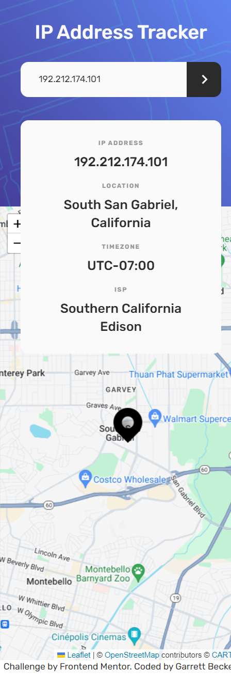

# Frontend Mentor - IP Address Tracker Solution

This is my solution to the [IP address tracker challenge on Frontend Mentor](https://www.frontendmentor.io/challenges/ip-address-tracker-I8-0yYAH0). I'm super thankful to have found Frontend Mentor as a great way to confidently grow in my coding skills with real-life projects. 

## Table of contents

- [Frontend Mentor - IP Address Tracker Solution](#frontend-mentor---ip-address-tracker-solution)
	- [Table of contents](#table-of-contents)
	- [Overview](#overview)
		- [Project Brief](#project-brief)
		- [Mobile View](#mobile-view)
		- [Desktop View](#desktop-view)
		- [Links](#links)
	- [My process](#my-process)
		- [Built with](#built-with)
		- [What I learned](#what-i-learned)
		- [Continued development](#continued-development)
		- [Useful resources](#useful-resources)
	- [Author](#author)
	- [Acknowledgments](#acknowledgments)

## Overview

### [Project Brief](./project%20brief/)

Your challenge is to build out this IP Address Tracker app and get it looking as close to the design as possible. To get the IP Address locations, you'll be using the [IP Geolocation API by IPify](https://geo.ipify.org/). To generate the map, we recommend using [LeafletJS](https://leafletjs.com/).

You can use any tools you like to help you complete the challenge. So if you've got something you'd like to practice, feel free to give it a go.

Your users should be able to:

- View the optimal layout for each page depending on their device's screen size
- See hover states for all interactive elements on the page
- See their own IP address on the map on the initial page load
- Search for any IP addresses or domains and see the key information and location

---

⚠️ **IMPORTANT** ⚠️: To use the IP Geolocation API by IPify, you'll need to sign up for a free account. You won't need to add any cards details to do this and it's a very quick process. This will generate an API Key for you. Usually, you would be able to restrict your API Key to a specific URL (your own domain). This makes sure that other people can't use your API Key on their own websites. IPify doesn't have this feature, but because you aren't adding your card details, this isn't an issue. **So be sure to only sign up for the free account and DO NOT enter any card details**.

For the mapping API, we recommend using [LeafletJS](https://leafletjs.com/). It's free to use and doesn't require an API Key. If you decide to use another API, like Google Maps or Mapbox, be sure to secure your API Key. Here are guides for both Google Maps and Mapbox, be sure to read through them thoroughly:

- [API Key best practices from Google Developers](https://developers.google.com/maps/api-key-best-practices)
- [How to use Mapbox securely](https://docs.mapbox.com/help/troubleshooting/how-to-use-mapbox-securely/)

Exposing your API Key publicly can lead to other people using it to make requests for their own application if the proper precautions aren't in place. Please be sure you read the guides thoroughly and follow their recommendations.

**We don't take any responsibility if you expose your API Key while completing the challenge and have not secured it.**

---

Want some support on the challenge? [Join our Slack community](https://www.frontendmentor.io/slack) and ask questions in the **#help** channel.

### Mobile View



### Desktop View


### Links

- [Solution URL](https://www.frontendmentor.io/solutions/ip-address-tracker-with-next-tailwind-2Zz94TGTex)
- [Live Site URL](https://ip-tracker-gdbecker.netlify.app/)

## My process

### Built with

- [React](https://reactjs.org/) - JS library
- [Next.js](https://nextjs.org) - React framework
- HTML5
- CSS
- [Tailwind CSS](https://tailwindcss.com) - CSS framework
- [LeafletJS](https://leafletjs.com/)
- [IP Geolocation API](https://geo.ipify.org/)
- Mobile-first workflow
- [VS Code](https://code.visualstudio.com)

### What I learned

This challenge gave a lot of great practice in using a new JS library, new API, and figuring out all the little styling details to match the design. Felt super accomplishing figuring it out! As usual I worked first on using Tailwind to get the look down on the main page, and then broke out the map container component to its own file. It took a lot of trial and error to get everything working, from the custom drop pin icon to collecting the right data to displaying the right map layer. I was surprised how tricky it was getting the map layer to work; had to go through at least three different urls to make the TileLayer work like I wanted it to. The page will automatically load with map data based on your current IP address with a quick 'loading' page appearing for better user experience, and it's a quick button click to find the latitude and longitude for any IP address, I'm happy with how this turned out and thankful for more Tailwind and API practice!

Here are a few code samples from this project:

```html
<!-- MapContainer component -->
<MapContainer 
	key={seed}
	center={[lat, lng]} 
	zoom="13" 
	scrollWheelZoom={false}
	className="flex min-h-screen z-0"
>
	<TileLayer
		attribution='&copy; <a href="https://www.openstreetmap.org/copyright">OpenStreetMap</a> contributors &copy; <a href="https://carto.com/attributions">CARTO</a>'
		// url="https://{s}.basemaps.cartocdn.com/rastertiles/voyager/{z}/{x}/{y}{r}.png"
		// url="https://tiles.stadiamaps.com/tiles/alidade_smooth_dark/{z}/{x}/{y}{r}.png"
		url="https://www.google.cn/maps/vt?lyrs=m@189&gl=cn&x={x}&y={y}&z={z}"
	/>
	<Marker position={[lat, lng]} >
		<Popup>{location}</Popup>
	</Marker>

</MapContainer>
```

```js
// Get new IP data
const fetchNewData = async () => {

	const API_KEY = "key"
	var response = "";

	if (ipSearch != '') {
		response = await fetch(`https://geo.ipify.org/api/v2/country,city?apiKey=${API_KEY}&ipAddress=${ipSearch}`);
	} else {
		const clientResponse = await fetch(
			'https://api.ipify.org?format=json'
		)
		const clientData = await clientResponse.json();
		response = await fetch(`https://geo.ipify.org/api/v2/country,city?apiKey=${API_KEY}&ipAddress=${clientData.ip}`);
	}

	const data = await response.json();
	console.log(data);

	setData({
		ipAddress: data.ip,
		location: data.location.city + ", " + data.location.region + " " + data.location.postalCode,
		lat: data.location.lat,
		lng: data.location.lng,
		timezone: "UTC" + data.location.timezone,
		isp: data.isp
	});

	setSeed(Math.random()); // Controls re-render of just the map

	setIPSearch('');

	setIsLoading(false);
}
```

### Continued development

As a starter developer, I want to keep growing in working as a team and learning how to deliver smaller packages of code at a time, such as robust and beautiful pages like this one. I thought this project was a good way to get back into Next.js and begin doing just that!

### Useful resources

- [CSS Formatter](http://www.lonniebest.com/FormatCSS/) - I found this helpful site when I'm feeling lazy and don't want to format my CSS code, I can have this do it for me, especially putting everything in alphabetical order.
- [Tailwind Grid](https://tailwindcss.com/docs/grid-template-columns) - Handy guide from Tailwind's docs about using grid-cols to structure content

## Author

- Website - [Garrett Becker]()
- Frontend Mentor - [@gdbecker](https://www.frontendmentor.io/profile/gdbecker)
- LinkedIn - [Garrett Becker](https://www.linkedin.com/in/garrett-becker-923b4a106/)

## Acknowledgments

Thank you to the Frontend Mentor team for providing all of these fantastic projects to build, and for our getting to help each other grow!