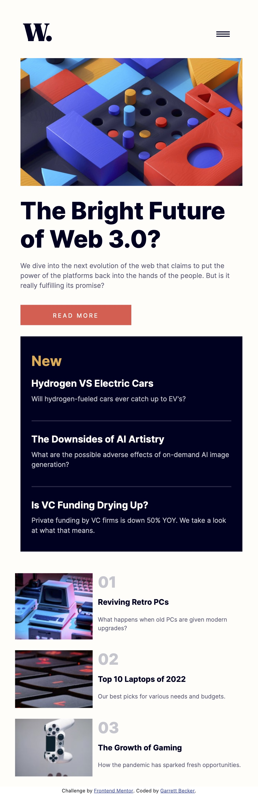

# Frontend Mentor - News Homepage Solution

This is my solution to the [News homepage challenge on Frontend Mentor](https://www.frontendmentor.io/challenges/news-homepage-H6SWTa1MFl). I'm super thankful to have found Frontend Mentor as a great way to confidently grow in my coding skills with real-life projects. 

## Table of contents

- [Overview](#overview)
  - [Project Brief](#project-brief)
  - [Mobile View](#mobile-view)
  - [Mobile View with Menu](#mobile-view-eith-menu)
  - [Desktop View](#desktop-view)
  - [Links](#links)
- [My process](#my-process)
  - [Built with](#built-with)
  - [What I learned](#what-i-learned)
  - [Continued development](#continued-development)
  - [Useful resources](#useful-resources)
- [Author](#author)
- [Acknowledgments](#acknowledgments)

## Overview

### [Project Brief](./project%20brief/)

Your challenge is to build out this news website homepage and get it looking as close to the design as possible.

You can use any tools you like to help you complete the challenge. So if you've got something you'd like to practice, feel free to give it a go.

Your users should be able to:

- View the optimal layout for the interface depending on their device's screen size
- See hover and focus states for all interactive elements on the page

Want some support on the challenge? [Join our Slack community](https://www.frontendmentor.io/slack) and ask questions in the **#help** channel.

### Mobile View



### Mobile View with Menu


### Desktop View


### Links

- [Solution URL]()
- [Live Site URL](https://news-homepage-gdbecker.netlify.app)

## My process

### Built with

- [React](https://reactjs.org/) - JS library
- HTML5
- CSS
- Bootstrap
- Mobile-first workflow
- [VS Code](https://code.visualstudio.com)

### What I learned

This was my first 'landing page' type of project for Frontend Mentor and it was a wonderful challenge - not just with the general grid layout but especially with the navbar. I used the usual Bootstrap responsive rows and columns I've been used to for the main content, and of course needed to play around with it to get everything in the right positions, especially the bottom 01 - 03 section. The navbar was tricky getting it to stay to the right of the screen but also feature that transparent dark background in between the page and navigation. When I first saw the design I doubted if I could get it working, but I'm really glad I pushed myself to break down the problem into smaller parts at a time to get it working. I ended up using a box-shadow effect to the left of the fixed navbar on mobile view to achieve the desired effect, and I think it looks good!

For the navbar buttons, I at first used a small bit of JS and React hooks to flip the hamburger to X and vice versa, and then accidentally figured out how to do it with just HTML and CSS, so I could comment out the JS code 😂.

Here are a few code samples from this project:

```html
<div className="collapse navbar-collapse" id="navbar">
  <button
      className="navbar-toggler pull-right"
      type="button"
      data-toggle="collapse"
      data-target="#navbar"
      aria-controls="navbar"
      aria-expanded="false"
      aria-label="Toggle navigation"
    >
      <span className="navbar-toggler-icon navbar-x"></span>
  </button>
  
  <ul className="navbar-nav ms-auto">
    <li className="nav-item">
      <a className="nav-link" href="/home">Home</a>
    </li>
    <li className="nav-item">
      <a className="nav-link" href="/new">New</a>
    </li>
    <li className="nav-item">
      <a className="nav-link" href='/popular'>Popular</a>
    </li>
    <li className="nav-item">
      <a className="nav-link" href='/trending'>Trending</a>
    </li>
    <li className="nav-item">
      <a className="nav-link" href='/categories'>Categories</a>
    </li>
  </ul>
</div>
```

```css

```

### Continued development

As a starter developer, I want to keep growing in working as a team and learning how to deliver robust and beautiful solutions like this one. I thought this project was a good way to get back into React and begin doing just that!

### Useful resources

- [CSS Formatter](http://www.lonniebest.com/FormatCSS/) - I found this helpful site when I'm feeling lazy and don't want to format my CSS code, I can have this do it for me, espcially putting everything in alphabetical order.
- [HSL to HEX Color Converter](https://htmlcolors.com/hsl-to-hex) - For a few of my Frontend Mentor projects I liked to convert the HSL into HEX codes just because I was more familiar with those, and this site was a handy link I had on hand to accomplish that
- [CSS Box Shadows](https://getcssscan.com/css-box-shadow-examples) - These are a helpful set of box-shadow styles with a wide variety of styles. This is one of those settings I'm coming to grips with so this is a great way to find one to start off with and then modify as needed.

## Author

- Website - [Garrett Becker]()
- Frontend Mentor - [@gdbecker](https://www.frontendmentor.io/profile/gdbecker)
- LinkedIn - [Garrett Becker](https://www.linkedin.com/in/garrett-becker-923b4a106/)

## Acknowledgments

Thank you to the Frontend Mentor team for providing all of these fantastic projects to build, and for our getting to help each other grow!