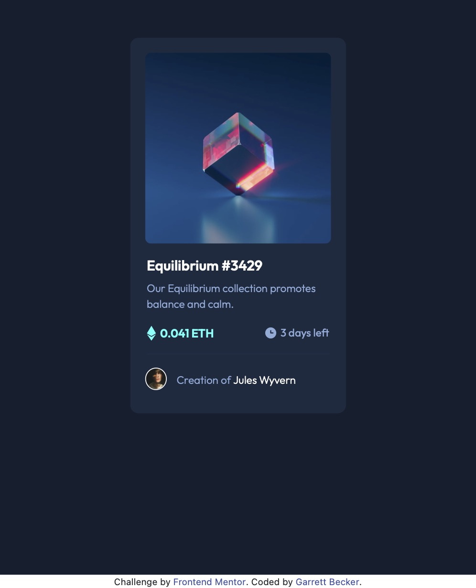

# Frontend Mentor - QR Code Component Solution

This is my solution to the [NFT preview card component challenge on Frontend Mentor](https://www.frontendmentor.io/challenges/nft-preview-card-component-SbdUL_w0U). I'm super thankful to have found Frontend Mentor as a great way to confidently grow in my coding skills with real-life projects. 

## Table of contents

- [Overview](#overview)
  - [Project Brief](#project-brief)
  - [Mobile View](#mobile-view)
  - [Desktop View](#desktop-view)
  - [Links](#links)
- [My process](#my-process)
  - [Built with](#built-with)
  - [What I learned](#what-i-learned)
  - [Continued development](#continued-development)
  - [Useful resources](#useful-resources)
- [Author](#author)
- [Acknowledgments](#acknowledgments)

## Overview

### [Project Brief](./project%20brief/)

Your challenge is to build out this preview card component and get it looking as close to the design as possible.

You can use any tools you like to help you complete the challenge. So if you've got something you'd like to practice, feel free to give it a go.

Your users should be able to:

- View the optimal layout depending on their device's screen size
- See hover states for interactive elements

Want some support on the challenge? [Join our Slack community](https://www.frontendmentor.io/slack) and ask questions in the **#help** channel.

### Mobile View



### Desktop View


### Links

- [Solution URL](https://www.frontendmentor.io/solutions/nft-card-component-with-react-bootstrap-hiW4LJD-cc)
- [Live Site URL](https://nft-card-gdbecker.netlify.app)

## My process

### Built with

- [React](https://reactjs.org/) - JS library
- HTML5
- CSS
- Bootstrap
- Mobile-first workflow
- [VS Code](https://code.visualstudio.com)

### What I learned

At the start I approached this project in a similar way as the QR code component, but the trickiest part was getting the hover state working for the image. It needed to be either an anchor tag or a button so it would take you somewhere, but also flash the eye symbol on top of a semi-transparent cyan background so you could still see the original pic underneath. After a lot of tinkering I got it to work by splitting images between a "box wrapper" and a "box" inside, so on hover the internal div switches from using the NFT image as the background to the eye symbol, and then the outer div switches to the blue background. I like how this turned out because then anyone can modify what pics are switched and can see how it works.

Here are a few code samples from this project:

```html
<div className="row g-1">
  <div className="nft-box-wrapper">
    <a href="/" className="nft-box-link"><div className="nft-box"></div></a>
  </div>
</div>
```

```css
.nft-box-wrapper {
  border-radius: 7px;
  margin-left: 0px !important;
  min-height: 230px;
  padding-left: 0px !important;
  padding-right: 0px !important;
}

.nft-box {
  background-image: url(assets/image-equilibrium.jpg);
  background-position: center center;
  background-repeat: no-repeat;
  background-size: cover;
  border-radius: 7px;
  max-width: 250px !important;
  min-height: 230px !important;
}

.nft-box-wrapper:hover {
  background-image: url(assets/image-equilibrium.jpg);
  background-position: center center;
  background-repeat: no-repeat;
  background-size: cover;
}

.nft-box:hover {
  background-color: rgb(0, 255, 247, 0.5);
  background-image: url(assets/icon-view.svg);
  background-position: center center;
  background-repeat: no-repeat;
  background-size: 17%;
}
```

### Continued development

As a starter developer, I want to keep growing in working as a team and learning how to deliver smaller packages of code at a time, such as components like this one. I thought this project was a good way to get back into React and begin doing just that!

### Useful resources

- [CSS Formatter](http://www.lonniebest.com/FormatCSS/) - I found this helpful site when I'm feeling lazy and don't want to format my CSS code, I can have this do it for me, espcially putting everything in alphabetical order.
- [CSS Box Shadows](https://getcssscan.com/css-box-shadow-examples) - These are a helpful set of box-shadow styles with a wide variety of styles. This is one of those settings I'm coming to grips with so this is a great way to find one to start off with and then modify as needed.

## Author

- Website - [Garrett Becker]()
- Frontend Mentor - [@gdbecker](https://www.frontendmentor.io/profile/gdbecker)
- LinkedIn - [Garrett Becker](https://www.linkedin.com/in/garrett-becker-923b4a106/)

## Acknowledgments

Thank you to the Frontend Mentor team for providing all of these fantastic projects to build, and for our getting to help each other grow!