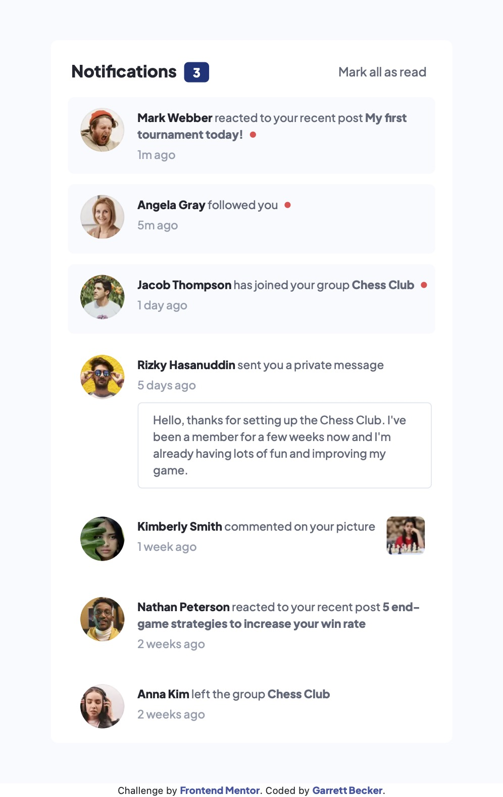

# Frontend Mentor - Notifications Page Solution

This is my solution to the [Notifications page challenge on Frontend Mentor](https://www.frontendmentor.io/challenges/notifications-page-DqK5QAmKbC). I'm super thankful to have found Frontend Mentor as a great way to confidently grow in my coding skills with real-life projects. 

## Table of contents

- [Overview](#overview)
  - [Project Brief](#project-brief)
  - [Mobile View](#mobile-view)
  - [Desktop View](#desktop-view)
  - [Links](#links)
- [My process](#my-process)
  - [Built with](#built-with)
  - [What I learned](#what-i-learned)
  - [Continued development](#continued-development)
  - [Useful resources](#useful-resources)
- [Author](#author)
- [Acknowledgments](#acknowledgments)

## Overview

### [Project Brief](./project%20brief/)

Your challenge is to build out this notifications page and get it looking as close to the design as possible.

You can use any tools you like to help you complete the challenge. So if you've got something you'd like to practice, feel free to give it a go.

Your users should be able to: 

- Distinguish between "unread" and "read" notifications
- Select "Mark all as read" to toggle the visual state of the unread notifications and set the number of unread messages to zero
- View the optimal layout for the interface depending on their device's screen size
- See hover and focus states for all interactive elements on the page

Want some support on the challenge? [Join our Slack community](https://www.frontendmentor.io/slack) and ask questions in the **#help** channel.

### Mobile View



### Desktop View


### Links

- [Solution URL]()
- [Live Site URL](https://notifications-page-gdbecker.netlify.app)

## My process

### Built with

- [React](https://reactjs.org/) - JS library
- HTML5
- CSS
- Bootstrap
- Mobile-first workflow
- [VS Code](https://code.visualstudio.com)

### What I learned

I really like how this project turned out in the end; it was a great challenge to create a professionally designed notifications page. It was also encouraging for me that as I keep pushing myself, I can see that I'm able to do this and create results that are beautiful and functional. Since most of the notification rows are almost the same, I worked on making the base design first, between the profile pic and main content, and then customized the base as needed for either the private message or extra image on the right. I used a tiny bit of JS to keep track of the clicked status of the top button, and that click caused for CSS classes to switch as needed - for the background color and indicator light. 

Here are a few code samples from this project:

```html
<div className="row mt-1 g-2">
  <div className={clicked ? "notification-row read" : "notification-row unread"}>
    <div className="notification-row-details">
        <div className="avatar-wrapper" style={{ backgroundImage: `url(${require("../assets/avatar-mark-webber.webp")})` }}></div>
        <div>
          <p className="notification-text"><span><a href="/" className="a-name">Mark Webber</a></span> reacted to your recent post <a href="/" className="a-noun">My first tournament today!</a> <span className={clicked ? "" : "unread-dot"}></span></p>
          <p className="notification-text time">1m ago</p>
        </div>
    </div>
  </div>
</div>
```

```css
.notification-row-details {
  display: flex;
}

.notification-row-details div:first-child {
  min-height: 7vh;
  min-width: 7vh;
}

.notification-row-details div:nth-child(2) {
  max-width: 85%;
}

.notification-row-details > .notification-img-wrapper {
  margin-left: auto;
  margin-right: 2%;
  min-height: 5vh;
  min-width: 5vh;
}
```

```js
const [clicked, setClicked] = useState('');

const onClick = async (e) => {
  setClicked(true);
}
```

### Continued development

As a starter developer, I want to keep growing in working as a team and learning how to deliver smaller packages of code at a time, such as components like this one. I thought this project was a good way to get back into React and begin doing just that!

### Useful resources

- [CSS Formatter](http://www.lonniebest.com/FormatCSS/) - I found this helpful site when I'm feeling lazy and don't want to format my CSS code, I can have this do it for me, especially putting everything in alphabetical order.
- [CSS Button Generator](https://css3buttongenerator.com) - Quickly make buttons by inputting desired features. This helps as I'm continuing to learn how to make buttons that meet design specs.

## Author

- Website - [Garrett Becker]()
- Frontend Mentor - [@gdbecker](https://www.frontendmentor.io/profile/gdbecker)
- LinkedIn - [Garrett Becker](https://www.linkedin.com/in/garrett-becker-923b4a106/)

## Acknowledgments

Thank you to the Frontend Mentor team for providing all of these fantastic projects to build, and for our getting to help each other grow!