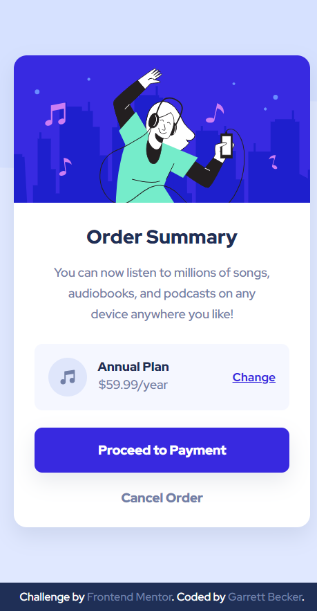

# Frontend Mentor - Order Summary Component Solution

This is my solution to the [Order summary component challenge on Frontend Mentor](https://www.frontendmentor.io/challenges/order-summary-component-QlPmajDUj). I'm super thankful to have found Frontend Mentor as a great way to confidently grow in my coding skills with real-life projects. 

## Table of contents

- [Frontend Mentor - Order Summary Component Solution](#frontend-mentor---order-summary-component-solution)
	- [Table of contents](#table-of-contents)
	- [Overview](#overview)
		- [Project Brief](#project-brief)
		- [Mobile View](#mobile-view)
		- [Desktop View](#desktop-view)
		- [Links](#links)
	- [My process](#my-process)
		- [Built with](#built-with)
		- [What I learned](#what-i-learned)
		- [Continued development](#continued-development)
		- [Useful resources](#useful-resources)
	- [Author](#author)
	- [Acknowledgments](#acknowledgments)

## Overview

### [Project Brief](./project%20brief/)

Your challenge is to build out this order summary card component and get it looking as close to the design as possible.

You can use any tools you like to help you complete the challenge. So if you've got something you'd like to practice, feel free to give it a go.

Your users should be able to:

- See hover states for interactive elements

Want some support on the challenge? [Join our community](https://www.frontendmentor.io/community) and ask questions in the **#help** channel.

### Mobile View



### Desktop View


### Links

- [Solution URL]()
- [Live Site URL](https://order-summary-component-gdbecker.netlify.app/)

## My process

### Built with

- HTML5
- CSS3
- [VS Code](https://code.visualstudio.com)

### What I learned

This was more good practice and a challenge for myself to build with only HTML & CSS, and there were several things to watch out with this component, including the background image and the card internal structure, specifically the 'annual plan' box. I got more practice using the 'before' pseudo selector on the body to add in the background image, and this changes to the mobile version on smaller screens. The details box in the card's center is a flex-row with a couple of flex-columns buried inside to achieve the look from the design. Once I got the desktop design down, I moved into the mobile version and used the media query to adjust the styles as needed. Happy with how this turned out! I definitely want to keep building more projects with the basic HTML, CSS, and JavaScript tools like in this one.

Here are a few code samples from this project:

```html
<!-- Center details structure -->
<div class="details">
	<div class="left">
		
		<div class="left-details">
			<h4>Annual Plan</h4>
			<p>$59.99/year</p>
		</div>
	</div>
	<div class="right">
		<a href="#">Change</a>
	</div>
</div>
```

```css
/* Styles for the center details box */
.details {
	display: flex;
	flex-direction: row;
	justify-content: space-between;
	align-items: center;
	background-color: var(--verypaleblue);
	border-radius: 9px;
	padding: 1.4rem;
	margin-top: 0.3rem;
}
```

### Continued development

As a starter developer, I want to keep growing in working as a team and learning how to deliver smaller packages of code at a time, such as components like this one. I thought this project was a good way to get back into React and begin doing just that!

### Useful resources

- [CSS Formatter](http://www.lonniebest.com/FormatCSS/) - I found this helpful site when I'm feeling lazy and don't want to format my CSS code, I can have this do it for me, especially putting everything in alphabetical order.
- Brad Traversy's [50 Projects In 50 Days - HTML, CSS & JavaScript course on Udemy](https://www.udemy.com/course/50-projects-50-days/) - I highly recommend this course for great practice in using just HTML, CSS, and vanilla JavaScript to build amazing projects.

## Author

- Website - [Garrett Becker]()
- Frontend Mentor - [@gdbecker](https://www.frontendmentor.io/profile/gdbecker)
- LinkedIn - [Garrett Becker](https://www.linkedin.com/in/garrett-becker-923b4a106/)

## Acknowledgments

Thank you to the Frontend Mentor team for providing all of these fantastic projects to build, and for our getting to help each other grow!