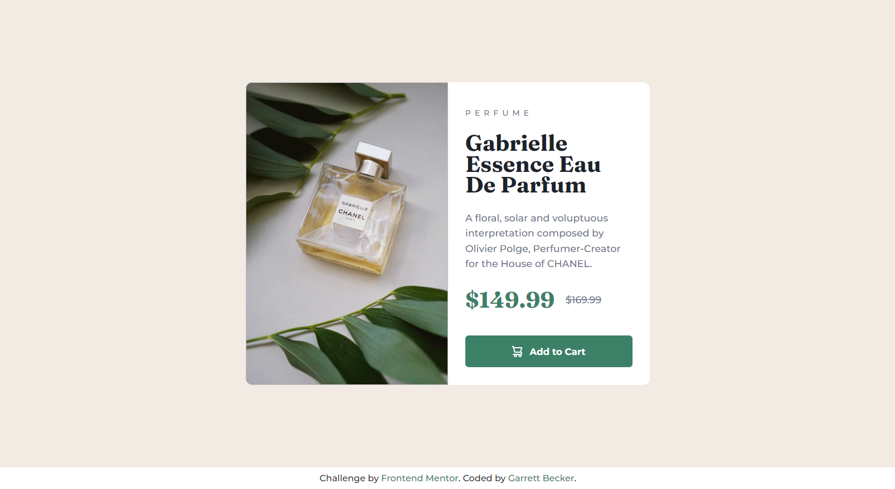

# Frontend Mentor - Product Preview Card Component Solution

This is my solution to the [Product preview card component challenge on Frontend Mentor](https://www.frontendmentor.io/challenges/product-preview-card-component-GO7UmttRfa). I'm super thankful to have found Frontend Mentor as a great way to confidently grow in my coding skills with real-life projects. 

## Table of contents

- [Frontend Mentor - Product Preview Card Component Solution](#frontend-mentor---product-preview-card-component-solution)
	- [Table of contents](#table-of-contents)
	- [Overview](#overview)
		- [Project Brief](#project-brief)
		- [Mobile View](#mobile-view)
		- [Desktop View](#desktop-view)
		- [Links](#links)
	- [My process](#my-process)
		- [Built with](#built-with)
		- [What I learned](#what-i-learned)
		- [Continued development](#continued-development)
		- [Useful resources](#useful-resources)
	- [Author](#author)
	- [Acknowledgments](#acknowledgments)

## Overview

### [Project Brief](./project%20brief/)

Your challenge is to build out this product preview card component and get it looking as close to the design as possible.

You can use any tools you like to help you complete the challenge. So if you've got something you'd like to practice, feel free to give it a go.

Your users should be able to:

- View the optimal layout depending on their device's screen size
- See hover and focus states for interactive elements

Want some support on the challenge? [Join our community](https://www.frontendmentor.io/community) and ask questions in the **#help** channel.

### Mobile View


### Desktop View



### Links

- [Solution URL]()
- [Live Site URL](https://product-preview-card-gdbecker.netlify.app)

## My process

### Built with

- HTML5
- CSS3
- Mobile-first workflow
- [VS Code](https://code.visualstudio.com)

### What I learned

After working through Brad Traversy's [50 Projects In 50 Days - HTML, CSS & JavaScript course on Udemy](https://www.udemy.com/course/50-projects-50-days/) this was great to keep practicing with vanilla HTML and CSS on this product preview card. Frameworks and utility classes are definitely helpful but I will say that I feel a lot more confident in my frontend skills by knowing the raw tools, especially with the CSS styles. I approached this one by getting the structure laid out as needed, using flex boxes and using flex-direction column or row, and then worked on each element's styling at a time. Once the desktop design was down then I adjusted to smaller mobile screens and tweaked the design from there. I definitely want to keep practicing using the basic tools in more projects like this one.

Here are a few code samples from this project:

```html
<!-- HTML Card Structure -->
<div class="card">
	

	<div class="content">
		<p class="type">PERFUME</p>
		<h1 class="title">Gabrielle Essence Eau De Parfum</h1>
		<p class="description">A floral, solar and voluptuous interpretation composed by Olivier Polge, Perfumer-Creator for the House of CHANEL.</p>

		<div class="price-row">
			<p class="main-price">$149.99</p>
			<p class="discount">$169.99</p>
		</div>

		<button class="add-btn">
			
			Add to Cart
		</button>
	</div>
</div>
```

```css
/* Styling for smaller screens */
@media(max-width: 600px) {
	.card {
		flex-direction: column;
		width: 344px;
	}

	.card-img {
		background-image: url('./public/image-product-mobile.jpg');
		width: 100%;
		height: 250px;
	}

	.content {
		width: 100%;
		padding-top: 15px;
	}

	.title {
		margin-top: 0;
	}

	.description {
		margin-top: -5px;
	}

	.price-row {
		margin-bottom: -15px;
	}
}
```

### Continued development

As a starter developer, I want to keep growing in working as a team and learning how to deliver smaller packages of code at a time, such as components like this one. I thought this project was a good way to get back into React and begin doing just that!

### Useful resources

- [CSS Formatter](http://www.lonniebest.com/FormatCSS/) - I found this helpful site when I'm feeling lazy and don't want to format my CSS code, I can have this do it for me, especially putting everything in alphabetical order.
- Brad Traversy's [50 Projects In 50 Days - HTML, CSS & JavaScript course on Udemy](https://www.udemy.com/course/50-projects-50-days/) - I highly recommend this course for great practice in using just HTML, CSS, and vanilla JavaScript to build amazing projects.

## Author

- Website - [Garrett Becker]()
- Frontend Mentor - [@gdbecker](https://www.frontendmentor.io/profile/gdbecker)
- LinkedIn - [Garrett Becker](https://www.linkedin.com/in/garrett-becker-923b4a106/)

## Acknowledgments

Thank you to the Frontend Mentor team for providing all of these fantastic projects to build, and for our getting to help each other grow!