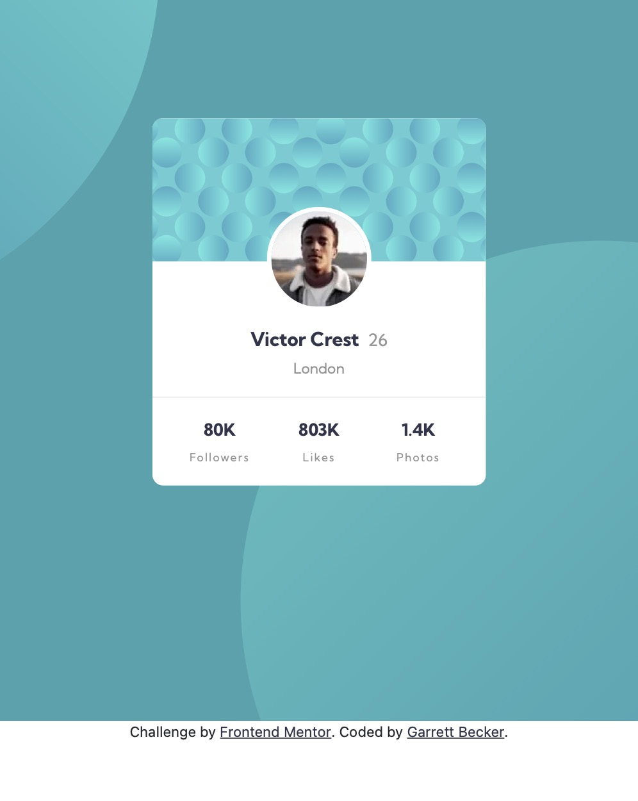

# Frontend Mentor - Profile Card Component Solution

This is my solution to the [Profile card component challenge on Frontend Mentor](https://www.frontendmentor.io/challenges/profile-card-component-cfArpWshJ). I'm super thankful to have found Frontend Mentor as a great way to confidently grow in my coding skills with real-life projects. 

## Table of contents

- [Overview](#overview)
  - [Project Brief](#project-brief)
  - [Mobile View](#mobile-view)
  - [Desktop View](#desktop-view)
  - [Links](#links)
- [My process](#my-process)
  - [Built with](#built-with)
  - [What I learned](#what-i-learned)
  - [Continued development](#continued-development)
  - [Useful resources](#useful-resources)
- [Author](#author)
- [Acknowledgments](#acknowledgments)

## Overview

### [Project Brief](./project%20brief/)

Your challenge is to build out this profile card component and get it looking as close to the design as possible.

You can use any tools you like to help you complete the challenge. So if you've got something you'd like to practice, feel free to give it a go.

Want some support on the challenge? [Join our Slack community](https://www.frontendmentor.io/slack) and ask questions in the **#help** channel.

### Mobile View



### Desktop View


### Links

- [Solution URL]()
- [Live Site URL](https://profile-card-gdbecker.netlify.app)

## My process

### Built with

- [React](https://reactjs.org/) - JS library
- [Next.js](https://nextjs.org) - React framework
- HTML5
- CSS
- [SASS](https://sass-lang.com) - CSS extension language
- Bootstrap
- Mobile-first workflow
- [VS Code](https://code.visualstudio.com)

### What I learned

I really enjoy how each of these frontend projects not only let you practice with whichever tools you choose, but also to push yourself and accomplish design challenges you may not have faced before. This profile card was great for me to practice some absolute positioning with the main profile image on the front - I tackled this one first by building the card elements and then positioning as needed - and then went for the background. I first tried putting both background images on the same <div> tag, but was having issues getting the positioning right, so I decided to try having two <div> layers for the background. That's what worked for me to give flexibility in positioning each one how I wanted depending on screen size. Really happy with how this one turned out!

Here are a few code samples from this project:

```html
<!-- HTML for the profile image section on the card -->
<div className="row">
  <div className="profile-wrapper">
    <Image
      src={Avatar}
      alt="Profile-Image"
      layout='fill'
      objectFit='contain'
    />
  </div>
</div>
```

```css
/* CSS for the dual-layered background images and the profile image positioning */
#home-page {
  align-items: center;
	background-image: url(../../public/bg-pattern-top.svg);
	background-position: -80vh -110vh;
	background-repeat: no-repeat;
	background-size: cover;
	justify-content: center;
	min-height: 90vh;
	padding: 8%;
	text-align: center;
}

#home-page-behind {
  background-color: $darkCyan;
	background-image: url(../../public/bg-pattern-bottom.svg);
	background-position: 80vh 30vh;
	background-repeat: no-repeat;
	background-size: cover;
}

.profile-wrapper {
  border: 4px solid $white !important;
	border-radius: 50% !important;
	height: 13vh !important;
	left: 0px;
	margin: auto;
	overflow: hidden;
	position: absolute;
	right: 0px;
	text-align: center;
	top: 80px;
	width: 13vh !important;
}
```

```js
// Loading in Bootstrap JS
const [loading, setLoading] = useState(true);

useEffect(() => {
  import ('bootstrap/dist/js/bootstrap.min.js');
  setLoading(false);
}, []);

if (loading) {
  return <LoadingPage />
}
```

### Continued development

As a starter developer, I want to keep growing in working as a team and learning how to deliver smaller packages of code at a time, such as components like this one. I thought this project was a good way to get back into React and begin doing just that!

### Useful resources

- [CSS Formatter](http://www.lonniebest.com/FormatCSS/) - I found this helpful site when I'm feeling lazy and don't want to format my CSS code, I can have this do it for me, especially putting everything in alphabetical order.
- [SASS Tutorial and Setup](https://www.youtube.com/watch?v=txg2fCPsYYU&t=241s) - This was a helpful quick tutorial I watched to help me get started with SASS and the live compiler in VS Code.

## Author

- Website - [Garrett Becker]()
- Frontend Mentor - [@gdbecker](https://www.frontendmentor.io/profile/gdbecker)
- LinkedIn - [Garrett Becker](https://www.linkedin.com/in/garrett-becker-923b4a106/)

## Acknowledgments

Thank you to the Frontend Mentor team for providing all of these fantastic projects to build, and for our getting to help each other grow!