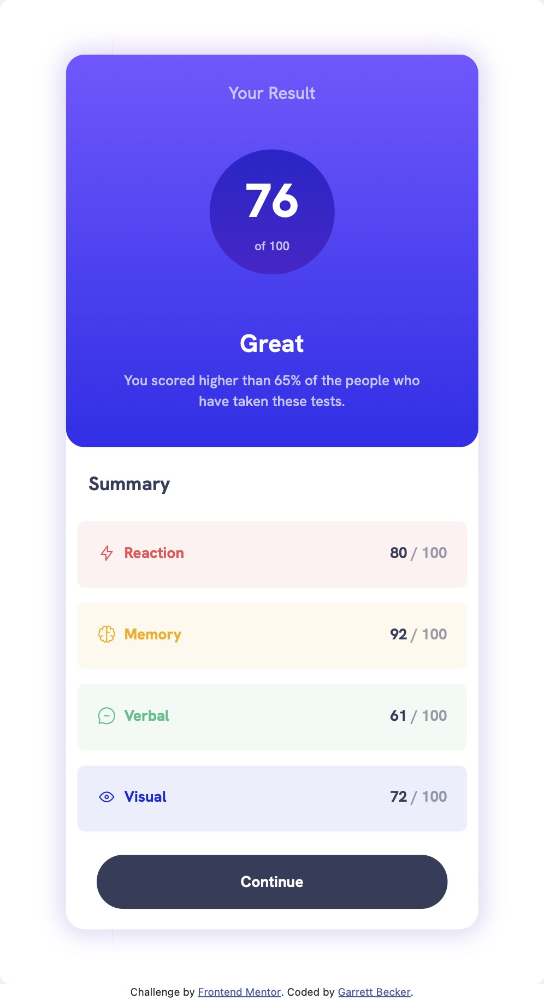

# Frontend Mentor - Results Summary Component Solution

This is my solution to the [Results summary component challenge on Frontend Mentor](https://www.frontendmentor.io/challenges/results-summary-component-CE_K6s0maV). I'm super thankful to have found Frontend Mentor as a great way to confidently grow in my coding skills with real-life projects. 

## Table of contents

- [Overview](#overview)
  - [Project Brief](#project-brief)
  - [Mobile View](#mobile-view)
  - [Desktop View](#desktop-view)
  - [Links](#links)
- [My process](#my-process)
  - [Built with](#built-with)
  - [What I learned](#what-i-learned)
  - [Continued development](#continued-development)
  - [Useful resources](#useful-resources)
- [Author](#author)
- [Acknowledgments](#acknowledgments)

## Overview

### [Project Brief](./project%20brief/)

Your challenge is to build out this results summary component and get it looking as close to the design as possible.

You can use any tools you like to help you complete the challenge. So if you've got something you'd like to practice, feel free to give it a go.

We provide the data for the results in a local `data.json` file. So you can use that to add the results and total score dynamically if you choose.

Your users should be able to:

- View the optimal layout for the interface depending on their device's screen size
- See hover and focus states for all interactive elements on the page

Want some support on the challenge? [Join our Slack community](https://www.frontendmentor.io/slack) and ask questions in the **#help** channel.

### Mobile View



### Desktop View


### Links

- [Solution URL](https://www.frontendmentor.io/solutions/results-component-with-react-bootstrap-EaorfiBf3j)
- [Live Site URL](https://results-component-gdbecker.netlify.app)

## My process

### Built with

- [React](https://reactjs.org/) - JS library
- HTML5
- CSS
- Bootstrap
- Mobile-first workflow
- [VS Code](https://code.visualstudio.com)

### What I learned

I thought this was a fun challenge not just to match the layout and feel, but also get more practice using React JS and hooks and import the provided .json data file. My first goal was to work on the design and make sure that I got the elements where I needed them, and then pushed myself to use a 'useEffect' hook to import the data on load, and then for each item in the data list, map the row of data to the component. I kept the code and data file as simple as possible so all you would need to do is adjust the values or file path of the icon and then on refresh the component would reflect those changes. 

Here are a few code samples from this project:

```html
{data.map((d) => (
  <div className={`row mt-3 row-result row-${d.category}`}>
    <div className="col">
      <h2 className={`section-2-label ${d.category}-label`}></img>{d.category}</h2>
    </div>
    <div className="col">
      <h2 className="section-2-results">{d.score} <span className="section-2-results-denominator">/ 100</span></h2>
    </div>
  </div>
))}
```

```css
.row-Reaction {
  background-color: rgb(255, 87, 87, 0.08);
}

.Reaction-label {
  color: #FF5757;
}

.row-Memory {
  background-color: rgb(255, 176, 31, 0.08);
}

.Memory-label {
  color: #FFB01F;
}
```

```js
const [data, setData] = useState([]);
const [score, setScore] = useState('');
const [isLoading, setIsLoading] = useState(true);

useEffect(() => {
  const fetchData = async () => {
    setData(dataFile);

    var sum = 0;
    var count = 0;
    for (var i = 0; i < dataFile.length; i++) {
      sum += dataFile[i]["score"];
      count += 1;
    }

    var ave = Math.round(sum / count);
    setScore(ave);

    setIsLoading(false);
  };

  fetchData();
}, []);
```

### Continued development

As a starter developer, I want to keep growing in working as a team and learning how to deliver smaller packages of code at a time, such as components like this one. I thought this project was a good way to get back into React and begin doing just that!

### Useful resources

- [CSS Formatter](http://www.lonniebest.com/FormatCSS/) - I found this helpful site when I'm feeling lazy and don't want to format my CSS code, I can have this do it for me, especially putting everything in alphabetical order.
- [CSS Button Generator](https://css3buttongenerator.com) - Quickly make buttons by inputting desired features. This helps as I'm continuing to learn how to make buttons that meet design specs.

## Author

- Website - [Garrett Becker]()
- Frontend Mentor - [@gdbecker](https://www.frontendmentor.io/profile/gdbecker)
- LinkedIn - [Garrett Becker](https://www.linkedin.com/in/garrett-becker-923b4a106/)

## Acknowledgments

Thank you to the Frontend Mentor team for providing all of these fantastic projects to build, and for our getting to help each other grow!