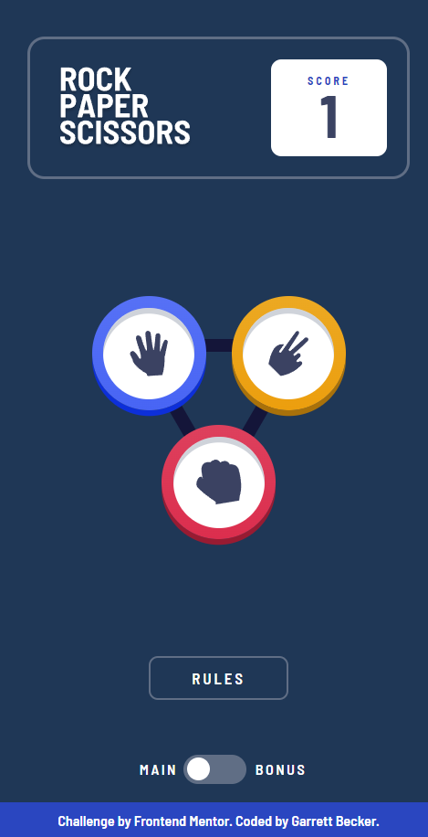
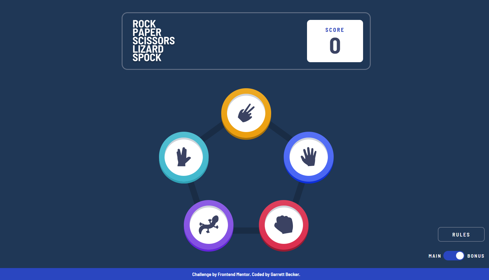

# Frontend Mentor - Rock, Paper, Scissors Game Solution

This is my solution to the [Rock, paper, scissors game challenge on Frontend Mentor](https://www.frontendmentor.io/challenges/rock-paper-scissors-game-pTgwgvgH). I'm super thankful to have found Frontend Mentor as a great way to confidently grow in my coding skills with real-life projects. 

## Table of contents

- [Frontend Mentor - Rock, Paper, Scissors Game Solution](#frontend-mentor---rock-paper-scissors-game-solution)
	- [Table of contents](#table-of-contents)
	- [Overview](#overview)
		- [Project Brief](#project-brief)
		- [Mobile View - Main Game](#mobile-view---main-game)
		- [Desktop View - Main Game](#desktop-view---main-game)
		- [Mobile View - Bonus Game](#mobile-view---bonus-game)
		- [Desktop View - Bonus Game](#desktop-view---bonus-game)
		- [Links](#links)
	- [My process](#my-process)
		- [Built with](#built-with)
		- [What I learned](#what-i-learned)
		- [Continued development](#continued-development)
		- [Useful resources](#useful-resources)
	- [Author](#author)
	- [Acknowledgments](#acknowledgments)

## Overview

### [Project Brief](./project%20brief/)

Your challenge is to build out this Rock, Paper, Scissors game and get it looking as close to the design as possible.

You can use any tools you like to help you complete the challenge. So if you've got something you'd like to practice, feel free to give it a go.

Your users should be able to:

- View the optimal layout for the game depending on their device's screen size
- Play Rock, Paper, Scissors against the computer
- **Bonus**: Maintain the state of the score after refreshing the browser
- **Bonus**: Play Rock, Paper, Scissors, Lizard, Spock against the computer

Want some support on the challenge? [Join our community](https://www.frontendmentor.io/community) and ask questions in the **#help** channel.

### Mobile View - Main Game



### Desktop View - Main Game


### Mobile View - Bonus Game


### Desktop View - Bonus Game



### Links

- [Solution URL](https://www.frontendmentor.io/solutions/rock-paper-scissors-game-with-html-css-javascript-1KCdykZHJI)
- [Live Site URL](https://rock-paper-scissors-gdbecker.netlify.app/)

## My process

### Built with

- HTML5
- CSS3
- JavaScript
- Mobile-first workflow
- [VS Code](https://code.visualstudio.com)

### What I learned

I'm really happy to have challenged myself with this project to not only take on a level 4 'advanced' challenge but also try it out with vanilla HTML, CSS, and JavaScript. Very excited with how this turned out! I ended up taking a bit longer to complete this over time but it's all good. Since there were several design challenges right away, from the buttons to their layout to even the header, I tackled this project one piece at a time with HTML structure and CSS style happening simultaneously. This kept me motivated and encouraged as I kept going because it felt great figuring out all the details of the button for example (image sizing, border width, shadows and click effect) to the buttons' layout. I knew I wanted to take on the bonus game also, but making sure I was happy with the base game first made it simpler to add the toggle switch to activate the other, which essentially hides/shows different divs containing different parts of the game.

I actually didn't see the triangle and pentagon background images at first in the provided files so I made the background triangles myself for the main game. That was challenging! Especially when it came to styling them based on screen widths, because they inevitably changed how the buttons appeared because of how I structured the HTML. There was a lot of CSS fine-tuning going on which was great practice. Luckily I found the pentagon background file for the bonus game so this was much easier to include, and the layout wasn't bad either; I used flex rows with different screen widths to achieve the layout I needed.

Writing the JavaScript for this project also felt super accomplishing once done, everything from the bonus game logic (with input arrays) to getting more practice with setTimeout() for time delays as the results loaded in. I broke apart logic into functions which I was glad I had the foresight for since I came back after a break to finish and it was easy to read and pick back up. Scores for both game modes are stored in the browser's LocalStorage and will default to 0 if it's your first time.

Rock-Paper-Scissors-Lizard-Spock was an excellent challenge, and I am very happy with this result!

Here are a few code samples from this project:

```html
<!-- Main game structure, with custom triangle background -->
<div id="main" class="main">
	<div class="triangle-outside"></div>
	<div class="triangle-inside"></div>

	<div class="btn btn-game" id="paper">
		<div class="btn-img" id="paper">
			
		</div>
	</div>

	<div class="btn btn-game" id="scissors">
		<div class="btn-img" id="scissors">
			
		</div>
	</div>

	<div class="btn btn-game" id="rock">
		<div class="btn-img" id="rock">
			
		</div>
	</div>
</div>
```

```css
/* A few style selectors for the buttons */
.btn {
	z-index: 1;
	cursor: pointer;
	border-radius: 50%;
	display: flex;
	justify-content: center;
	align-items: center;
	width: 155px;
	height: 155px;
	margin: 1rem 2rem;
}

.btn-game:active {
	box-shadow: none !important;
	transform: translateY(5px);
}

.btn-img {
	background-color: var(--white);
	display: flex;
	justify-content: center;
	align-items: center;
	border-radius: 50%;
	width: 120px;
	height: 120px;
	box-shadow: inset 0px 5px var(--insetboxshadow);
}
```

```javascript
// Function to build the bigger buttons on the result screen, flexible for either the player or computer side
function buildResultBtn(player, col) {
	const div = document.createElement('div');
	div.classList.add('btn');
	div.classList.add('btn-result');
	div.id = player;
	div.innerHTML = `
		<div class="btn-img">
		
	</div>
	`;

	// Place the button in a different spot, depending on screen size
	if (window.innerWidth > 680) {
		col.appendChild(div);
	} else {
		col.insertBefore(div, col.firstChild);
	}
}
```

### Continued development

As a starter developer, I want to keep growing in working as a team and learning how to deliver smaller packages of code at a time, such as components like this one. I thought this project was a good way to get back into React and begin doing just that!

### Useful resources

- [CSS Formatter](http://www.lonniebest.com/FormatCSS/) - I found this helpful site when I'm feeling lazy and don't want to format my CSS code, I can have this do it for me, especially putting everything in alphabetical order.
- Brad Traversy's [50 Projects In 50 Days - HTML, CSS & JavaScript course on Udemy](https://www.udemy.com/course/50-projects-50-days/) - I highly recommend this course for great practice in using just HTML, CSS, and vanilla JavaScript to build amazing projects.
- [Bonus Game Logic from StackOverflow](https://stackoverflow.com/questions/22623331/rock-paper-scissors-lizard-spock-in-javascript) - Had some assistance in tuning the bonus game logic

## Author

- Website - [Garrett Becker]()
- Frontend Mentor - [@gdbecker](https://www.frontendmentor.io/profile/gdbecker)
- LinkedIn - [Garrett Becker](https://www.linkedin.com/in/garrett-becker-923b4a106/)

## Acknowledgments

Thank you to the Frontend Mentor team for providing all of these fantastic projects to build, and for our getting to help each other grow!