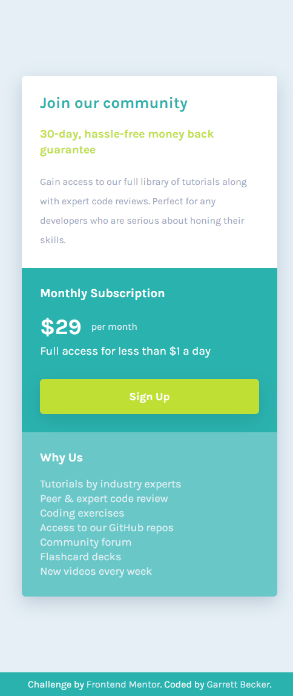
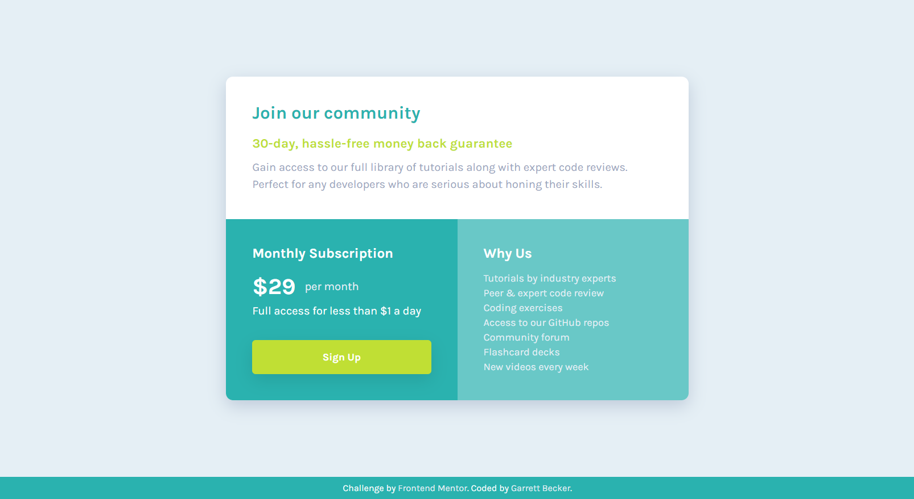

# Frontend Mentor - Single Price Grid Component Solution

This is my solution to the [Single price grid component challenge on Frontend Mentor](https://www.frontendmentor.io/challenges/single-price-grid-component-5ce41129d0ff452fec5abbbc). I'm super thankful to have found Frontend Mentor as a great way to confidently grow in my coding skills with real-life projects. 

## Table of contents

- [Frontend Mentor - Single Price Grid Component Solution](#frontend-mentor---single-price-grid-component-solution)
	- [Table of contents](#table-of-contents)
	- [Overview](#overview)
		- [Project Brief](#project-brief)
		- [Mobile View](#mobile-view)
		- [Desktop View](#desktop-view)
		- [Links](#links)
	- [My process](#my-process)
		- [Built with](#built-with)
		- [What I learned](#what-i-learned)
		- [Continued development](#continued-development)
		- [Useful resources](#useful-resources)
	- [Author](#author)
	- [Acknowledgments](#acknowledgments)

## Overview

### [Project Brief](./project%20brief/)

Your users should be able to:

- View the optimal layout for the component depending on their device's screen size
- See a hover state on desktop for the Sign Up call-to-action

Want some support on the challenge? [Join our community](https://www.frontendmentor.io/community) and ask questions in the **#help** channel.

### Mobile View



### Desktop View



### Links

- [Solution URL](https://www.frontendmentor.io/solutions/single-price-grid-component-with-html-css-rvvACzqxRj)
- [Live Site URL](https://single-price-grid-component-gdbecker.netlify.app)

## My process

### Built with

- HTML5
- CSS3
- Mobile-first workflow
- [VS Code](https://code.visualstudio.com)

### What I learned

This card was more great practice for building projects with only HTML and CSS, and doing more with the basic tools is giving me a lot more confidence and comfort in my skills to structure and design. In a similar approach to the recipe page challenge, I went section by section for this component to add content and style at the same time, checking in with the design guide and pics for each part. I used flex boxes for the main card itself and divided the top from the bottom as well as the middle two sections in the bottom half to keep it simpler to control backgrounds, padding, etc. I definitely want to keep practicing using the basic tools in more projects like this one.

Here are a few code samples from this project:

```html
<!-- Card bottom section -->
<div class="bottom">
	<div class="first">
		<h2>Monthly Subscription</h2>
		<div class="price-row">
			<p class="price-dollar">&dollar;29</p>
			<p class="price-detail">per month</p>
		</div>
		<p class="price-description">Full access for less than &dollar;1 a day</p>
		<button>Sign Up</button>
	</div>
	<div class="second">
		<h2>Why Us</h2>
		<p class="why">Tutorials by industry experts</p>
		<p class="why">Peer &amp; expert code review</p>
		<p class="why">Coding exercises</p>
		<p class="why">Access to our GitHub repos</p>
		<p class="why">Community forum</p>
		<p class="why">Flashcard decks</p>
		<p class="why">New videos every week</p>
	</div>
</div>
```

```css
/* Card bottom styling */
.bottom {
	display: flex;
	flex-direction: row;
	color: var(--white);
	height: 65%;
}

.first {
	width: 50%;
	padding: 2.3rem;
	background-color: var(--cyandark);
	display: flex;
	flex-direction: column;
	justify-content: space-between;
}

.second {
	width: 50%;
	padding: 2.3rem;
	background-color: var(--cyanlight);
}
```

### Continued development

As a starter developer, I want to keep growing in working as a team and learning how to deliver smaller packages of code at a time, such as components like this one. I thought this project was a good way to get back into React and begin doing just that!

### Useful resources

- [CSS Formatter](http://www.lonniebest.com/FormatCSS/) - I found this helpful site when I'm feeling lazy and don't want to format my CSS code, I can have this do it for me, especially putting everything in alphabetical order.
- Brad Traversy's [50 Projects In 50 Days - HTML, CSS & JavaScript course on Udemy](https://www.udemy.com/course/50-projects-50-days/) - I highly recommend this course for great practice in using just HTML, CSS, and vanilla JavaScript to build amazing projects.

## Author

- Website - [Garrett Becker]()
- Frontend Mentor - [@gdbecker](https://www.frontendmentor.io/profile/gdbecker)
- LinkedIn - [Garrett Becker](https://www.linkedin.com/in/garrett-becker-923b4a106/)

## Acknowledgments

Thank you to the Frontend Mentor team for providing all of these fantastic projects to build, and for our getting to help each other grow!