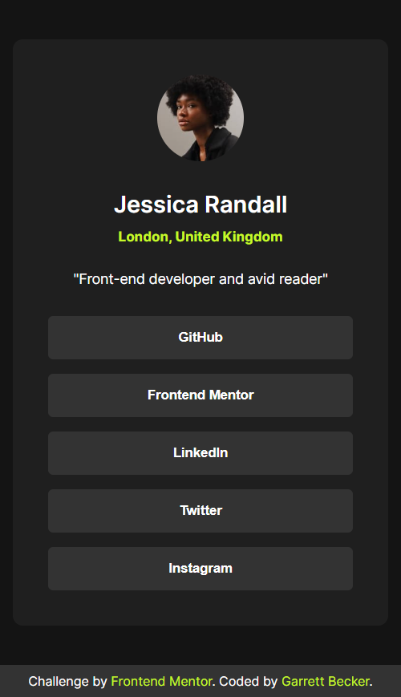

# Frontend Mentor - Social Links Profile Solution

This is my solution to the [Social links profile challenge on Frontend Mentor](https://www.frontendmentor.io/challenges/social-links-profile-UG32l9m6dQ). I'm super thankful to have found Frontend Mentor as a great way to confidently grow in my coding skills with real-life projects. 

## Table of contents

- [Frontend Mentor - Social Links Profile Solution](#frontend-mentor---social-links-profile-solution)
	- [Table of contents](#table-of-contents)
	- [Overview](#overview)
		- [Project Brief](#project-brief)
		- [Mobile View](#mobile-view)
		- [Desktop View](#desktop-view)
		- [Links](#links)
	- [My process](#my-process)
		- [Built with](#built-with)
		- [What I learned](#what-i-learned)
		- [Continued development](#continued-development)
		- [Useful resources](#useful-resources)
	- [Author](#author)
	- [Acknowledgments](#acknowledgments)

## Overview

### [Project Brief](./project%20brief/)

Your challenge is to build out this social links profile and get it looking as close to the design as possible.

You can use any tools you like to help you complete the challenge. So if you've got something you'd like to practice, feel free to give it a go.

Your users should be able to: 

- See hover and focus states for all interactive elements on the page

Want some support on the challenge? [Join our community](https://www.frontendmentor.io/community) and ask questions in the **#help** channel.

### Mobile View



### Desktop View


### Links

- [Solution URL](https://www.frontendmentor.io/solutions/social-links-profile-with-html-css-gBmKT4syK4)
- [Live Site URL](https://social-links-profile-gdbecker.netlify.app)

## My process

### Built with

- HTML5
- CSS3
- Mobile-first workflow
- [VS Code](https://code.visualstudio.com)

### What I learned

While I greatly enjoy using the various frontend frameworks we have, I wanted to try out a few Frontend Mentor challenges with just basic HTML, CSS, and vanilla JavaScript and first up is this social links profile component. I had been working through one of Brad Traversy's Udemy courses to practice and learn more, and I thought this challenge was perfect - I was surprised how quickly it came together. I focused first on getting the structure down, making use of flex boxes and flex direction, and then tackling each of the profile segments at a time. Using variables at the root level made it simpler to keep track of colors, and I also decided to add some a small scale animation for button clicks to make it more interesting. I definitely want to keep practicing using the basic tools in more projects like this one.

Here are a few code samples from this project:

```html
<!-- Profile card structure -->
<div class="card">
	
	<h1 class="profile-name">Jessica Randall</h1>
	<h2 class="profile-location">London, United Kingdom</h2>
	<p class="profile-about">"Front-end developer and avid reader"</p>

	<div class="socials">
		<button class="social">GitHub</button>
		<button class="social">Frontend Mentor</button>
		<button class="social">LinkedIn</button>
		<button class="social">Twitter</button>
		<button class="social">Instagram</button>
	</div>
</div>
```

```css
/* Social button styling */
.social {
	padding: 0.85rem;
	font-weight: bold;
	border-radius: 5px;
	cursor: pointer;
	margin-top: 0.9rem;
	border: none;
	background-color: var(--grey);
	color: var(--white);
}

.social:focus {
	outline: none;
}

.social:hover {
	background-color: var(--green);
	color: var(--darkgrey);
}

.social:active {
	transform: scale(0.98);
}
```

### Continued development

As a starter developer, I want to keep growing in working as a team and learning how to deliver smaller packages of code at a time, such as components like this one. I thought this project was a good way to get back into vanilla HTML, CSS, and JavaScript and begin doing just that!

### Useful resources

- [CSS Formatter](http://www.lonniebest.com/FormatCSS/) - I found this helpful site when I'm feeling lazy and don't want to format my CSS code, I can have this do it for me, especially putting everything in alphabetical order.
- Brad Traversy's [50 Projects In 50 Days - HTML, CSS & JavaScript course on Udemy](https://www.udemy.com/course/50-projects-50-days/) - I highly recommend this course for great practice in using just HTML, CSS, and vanilla JavaScript to build amazing projects.

## Author

- Website - [Garrett Becker]()
- Frontend Mentor - [@gdbecker](https://www.frontendmentor.io/profile/gdbecker)
- LinkedIn - [Garrett Becker](https://www.linkedin.com/in/garrett-becker-923b4a106/)

## Acknowledgments

Thank you to the Frontend Mentor team for providing all of these fantastic projects to build, and for our getting to help each other grow!