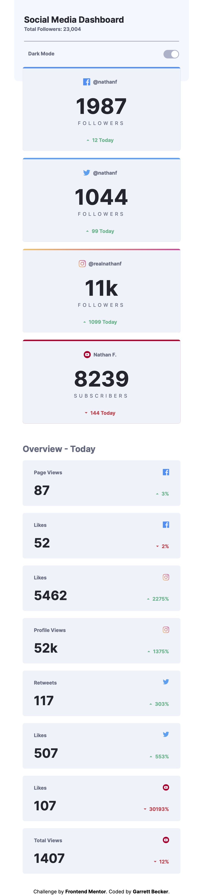
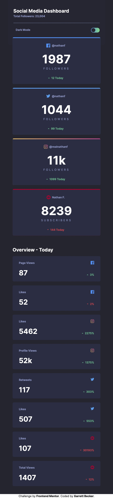
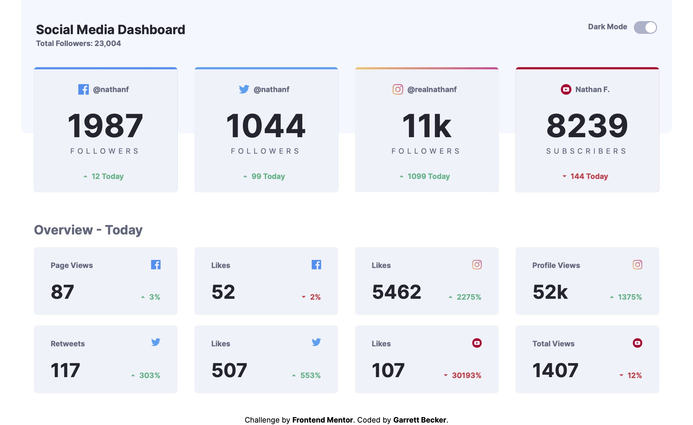

# Frontend Mentor - Testimonials Grid Section Solution

This is my solution to the [Social media dashboard with theme switcher challenge on Frontend Mentor](https://www.frontendmentor.io/challenges/social-media-dashboard-with-theme-switcher-6oY8ozp_H). I'm super thankful to have found Frontend Mentor as a great way to confidently grow in my coding skills with real-life projects. 

## Table of contents

- [Overview](#overview)
  - [Project Brief](#project-brief)
  - [Mobile View Light Theme](#mobile-view-light-theme)
  - [Mobile View Dark Theme](#mobile-view-dark-theme)
  - [Desktop View Light Theme](#desktop-view-light-theme)
  - [Desktop View Dark Theme](#desktop-view-dark-theme)
  - [Links](#links)
- [My process](#my-process)
  - [Built with](#built-with)
  - [What I learned](#what-i-learned)
  - [Continued development](#continued-development)
  - [Useful resources](#useful-resources)
- [Author](#author)
- [Acknowledgments](#acknowledgments)

## Overview

### [Project Brief](./project%20brief/)

Your challenge is to build out this Social Media Dashboard and get it looking as close to the design as possible.

You can use any tools you like to help you complete the challenge. So if you've got something you'd like to practice, feel free to give it a go.

Your users should be able to:

- View the optimal layout for the site depending on their device's screen size
- See hover states for all interactive elements on the page
- Toggle color theme to their preference

Want some support on the challenge? [Join our Slack community](https://www.frontendmentor.io/slack) and ask questions in the **#help** channel.

### Mobile View Light Theme



### Mobile View Dark Theme



### Desktop View Light Theme



### Desktop View Dark Theme


### Links

- [Solution URL]()
- [Live Site URL](https://social-media-dashboard-gdbecker.netlify.app)

## My process

### Built with

- [React](https://reactjs.org/) - JS library
- [Next.js](https://nextjs.org) - React framework
- HTML5
- CSS
- [Tailwind CSS](https://tailwindcss.com) - CSS framework
- Mobile-first workflow
- [VS Code](https://code.visualstudio.com)

### What I learned

When I found out that Tailwind had an intuitive way of switching between light and dark CSS themes, I knew I had to give it a go with this social media dashboard project. Really happy with how this turned out! I approached it by first getting the structure down for the whole page on light theme, and once it was in a good place I adjusted the tailwind.config file to discern the dark theme mode by className. It was simple adjusting the colors and feel by using "dark:" as a prefix in the utility classes, and I put those at the end of each className to keep them consistent spot. Since there was also quite a bit of repetitive code I decided to make separate components for the first four "account cards" and then for the bottom eight "detail cards" to make my code simpler and easier to read and manage. I'm proud of this one and definitely want to keep practicing using themes in Tailwind!

Here are a few code samples from this project:

```html
<!-- 'AccountCard' component for the top row of cards -->
<a href="/" className={getBackground(social)}>
  <div className="bg-lightTheme-300 text-center justify-center rounded-bl-md rounded-br-md hover:bg-lightToggle dark:bg-darkTheme-300 dark:hover:bg-lightTheme-400">
    <div className="justify-center flex flex-row py-7">
      <Image src={getSocialIcon(social)} alt="Facebook" width={20} height={20}/>
      <p className="font-interBold text-sm text-lightTheme-400 px-2 dark:text-darkTheme-400">{handle}</p>
    </div>
    <h1 className="font-interBold text-6xl text-lightTheme-500 dark:text-darkTheme-500">{value}</h1>
    <p className="text-lightTheme-400 text-sm tracking-[0.4em] py-2 dark:text-darkTheme-400">{title}</p>
    <div className="justify-center flex flex-row py-5">
      <div className="w-2 pt-2 items-end justify-center">
        <Image src={getDirectionIcon(direction)} alt="Direction-Arrow" width={10} height={0}/>
      </div>
      <p className={getCountColor(direction)}>{count} Today</p>
    </div>
  </div>
</a>

<!-- Using the component on the main page -->
<AccountCard 
  social="instagram"
  handle="@realnathanf"
  value="11k"
  title="FOLLOWERS"
  direction="up"
  count="1099"
/>
```

```css
/* Importing custom font in my main CSS file */
@font-face {
  font-family: Inter-Regular;
  src: url(../../public/Inter-Regular.ttf);
}
```

```js
// Two functions in the 'AccountCard' component
// Returns the className for the indicator arrow/text
function getCountColor(direction) {
  if (direction == 'up') {
    return 'text-green font-interBold text-sm px-2';
  } else if (direction == 'down') {
    return 'text-red font-interBold text-sm px-2';
  }
}

// Returns the className for the top color bar of the card
function getBackground(social) {
  if (social == 'facebook') {
    return 'basis-1/5 flex-1 bg-facebook pt-1 rounded-md';
  } else if (social == 'twitter') {
    return 'basis-1/5 flex-1 bg-twitter pt-1 rounded-md';
  } else if (social == 'instagram') {
    return 'basis-1/5 flex-1 bg-gradient-to-r from-instagram-100 to-instagram-200 pt-1 rounded-md';
  } else if (social == 'youtube') {
    return 'basis-1/5 flex-1 bg-youtube pt-1 rounded-md';
  }
}
```

### Continued development

As a starter developer, I want to keep growing in working as a team and learning how to deliver smaller packages of code at a time, such as robust and beautiful pages like this one. I thought this project was a good way to get back into React and begin doing just that!

### Useful resources

- [CSS Formatter](http://www.lonniebest.com/FormatCSS/) - I found this helpful site when I'm feeling lazy and don't want to format my CSS code, I can have this do it for me, especially putting everything in alphabetical order.
- [Tailwind Grid](https://tailwindcss.com/docs/grid-template-columns) - Handy guide from Tailwind's docs about using grid-cols to structure content

## Author

- Website - [Garrett Becker]()
- Frontend Mentor - [@gdbecker](https://www.frontendmentor.io/profile/gdbecker)
- LinkedIn - [Garrett Becker](https://www.linkedin.com/in/garrett-becker-923b4a106/)

## Acknowledgments

Thank you to the Frontend Mentor team for providing all of these fantastic projects to build, and for our getting to help each other grow!