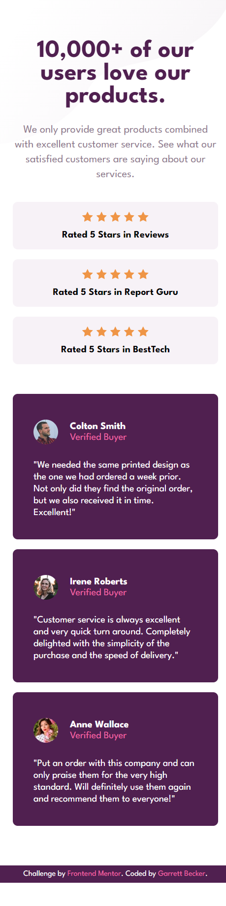

# Frontend Mentor - Social Proof Section Solution

This is my solution to the [Social proof section challenge on Frontend Mentor](https://www.frontendmentor.io/challenges/social-proof-section-6e0qTv_bA). I'm super thankful to have found Frontend Mentor as a great way to confidently grow in my coding skills with real-life projects. 

## Table of contents

- [Frontend Mentor - Social Proof Section Solution](#frontend-mentor---social-proof-section-solution)
	- [Table of contents](#table-of-contents)
	- [Overview](#overview)
		- [Project Brief](#project-brief)
		- [Mobile View](#mobile-view)
		- [Desktop View](#desktop-view)
		- [Links](#links)
	- [My process](#my-process)
		- [Built with](#built-with)
		- [What I learned](#what-i-learned)
		- [Continued development](#continued-development)
		- [Useful resources](#useful-resources)
	- [Author](#author)
	- [Acknowledgments](#acknowledgments)

## Overview

### [Project Brief](./project%20brief/)

Your challenge is to build out this social proof section and get it looking as close to the design as possible.

You can use any tools you like to help you complete the challenge. So if you've got something you'd like to practice, feel free to give it a go.

Your users should be able to:

- View the optimal layout for the section depending on their device's screen size

Want some support on the challenge? [Join our community](https://www.frontendmentor.io/community) and ask questions in the **#help** channel.

### Mobile View



### Desktop View


### Links

- [Solution URL](https://www.frontendmentor.io/solutions/social-proof-section-with-html-css-_QFmuPvzpf)
- [Live Site URL](https://social-proof-section-gdbecker.netlify.app/)

## My process

### Built with

- HTML5
- CSS3
- Mobile-first workflow
- [VS Code](https://code.visualstudio.com)

### What I learned

Glad I picked up this challenge since I've been getting used to flex boxes and building layouts - there were a lot of great things to figure out from the backgrounds in the corners, to each of the cards on top and bottom of the screen, as well as figuring out the styling to get the staggered look. I could visualize in my head that I needed various flex-rows and columns to get the overall structure, and I fine-tuned the proportions as best I could to match the design before moving on to staggering the cards. I decided to adjust the margin-right for the top review boxes and then the margin-bottom for the bottom cards to achieve the structure, using ids on each to specify which one to move. This was also good practice using the 'before' and 'after' pseudo selectors on the body to add in the corner background images. I'm happy with how the page turned out! I definitely want to keep building more projects with the basic HTML, CSS, and JavaScript tools like in this one.

Here are a few code samples from this project:

```html
<!-- Top review box structure -->
<div id="review1" class="review-box">
	<span>
		
		
		
		
		
	</span>
	<p>Rated 5 Stars in Reviews</p>
</div>

<!-- Bottom card structure -->
<div id="card1" class="card">
	<div class="card-header">
		
		<div class="card-header-details">
			<h3>Colton Smith</h3>
			<h4>Verified Buyer</h4>
		</div>
	</div>
	<p>
		"We needed the same printed design as the one we had ordered a week prior. Not only did they find the original order, but we also received it in time. Excellent!"
	</p>
</div>
```

```css
/* Styles for review boxes and cards */
.review-box {
	display: flex;
	flex-direction: row;
	align-items: center;
	justify-content: start;
	background-color: var(--lightgrayishmagenta);
	width: 435px;
	padding: 0.2rem 1.75rem;
	border-radius: 8px;
	margin: 0.5rem 0;
}

.card {
	background-color: var(--darkmagenta);
	padding: 2.1rem;
	display: flex;
	flex-direction: column;
	justify-content: center;
	align-items: space-between;
	width: 350px;
	border-radius: 8px;
}
```

### Continued development

As a starter developer, I want to keep growing in working as a team and learning how to deliver smaller packages of code at a time, such as components like this one. I thought this project was a good way to get back into React and begin doing just that!

### Useful resources

- [CSS Formatter](http://www.lonniebest.com/FormatCSS/) - I found this helpful site when I'm feeling lazy and don't want to format my CSS code, I can have this do it for me, especially putting everything in alphabetical order.
- Brad Traversy's [50 Projects In 50 Days - HTML, CSS & JavaScript course on Udemy](https://www.udemy.com/course/50-projects-50-days/) - I highly recommend this course for great practice in using just HTML, CSS, and vanilla JavaScript to build amazing projects.

## Author

- Website - [Garrett Becker]()
- Frontend Mentor - [@gdbecker](https://www.frontendmentor.io/profile/gdbecker)
- LinkedIn - [Garrett Becker](https://www.linkedin.com/in/garrett-becker-923b4a106/)

## Acknowledgments

Thank you to the Frontend Mentor team for providing all of these fantastic projects to build, and for our getting to help each other grow!