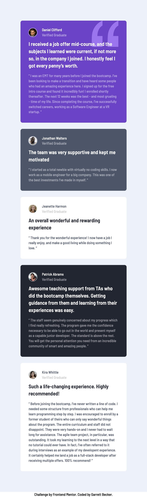

# Frontend Mentor - Testimonials Grid Section Solution

This is my solution to the [Testimonials grid section challenge on Frontend Mentor](https://www.frontendmentor.io/challenges/testimonials-grid-section-Nnw6J7Un7). I'm super thankful to have found Frontend Mentor as a great way to confidently grow in my coding skills with real-life projects. 

## Table of contents

- [Overview](#overview)
  - [Project Brief](#project-brief)
  - [Mobile View](#mobile-view)
  - [Desktop View](#desktop-view)
  - [Links](#links)
- [My process](#my-process)
  - [Built with](#built-with)
  - [What I learned](#what-i-learned)
  - [Continued development](#continued-development)
  - [Useful resources](#useful-resources)
- [Author](#author)
- [Acknowledgments](#acknowledgments)

## Overview

### [Project Brief](./project%20brief/)

Your challenge is to build out this testimonials grid section and get it looking as close to the design as possible.

You can use any tools you like to help you complete the challenge. So if you've got something you'd like to practice, feel free to give it a go.

Your users should be able to:

- View the optimal layout for the site depending on their device's screen size

Want some support on the challenge? [Join our Slack community](https://www.frontendmentor.io/slack) and ask questions in the **#help** channel.

### Mobile View



### Desktop View


### Links

- [Solution URL](https://www.frontendmentor.io/solutions/testimonials-grid-with-next-tailwind-Jk2KbMWvmV)
- [Live Site URL](https://testimonials-grid-gdbecker.netlify.app)

## My process

### Built with

- [React](https://reactjs.org/) - JS library
- [Next.js](https://nextjs.org) - React framework
- HTML5
- CSS
- [Tailwind CSS](https://tailwindcss.com) - CSS framework
- Mobile-first workflow
- [VS Code](https://code.visualstudio.com)

### What I learned

I took on this project for practicing CSS grid structures, specifically using Tailwind's utility classes for columns and rows, and it was challenging in a great way. The trick was figuring out how to maintain the single column row for mobile view but expanding out the content to the right structure on larger screens. I liked playing around with different classes and trying things out to see what worked and what didn't - I learn so much this way by simply experimenting and digging in. In the end I found that sectioning off the first four content cards into a grid and then the last one into its down grid worked the best as I changed screen size. I like how Tailwind pushes you to design mobile-first and then go up from there because it meets a lot of people where they're at on mobile devices, and I find it more intuitive to start designing small and grow from there.

Here are a few code samples from this project:

```html
<!-- First content card with special quote symbol background -->
<div className="px-8 py-6 bg-violet-100 rounded-lg font-barlowMedium bg-[url('../../public/bg-pattern-quotation.svg')] bg-no-repeat bg-[right_2rem_top_0rem] md:bg-[right_6rem_top_0rem] md:col-span-2">
  <div className="flex flex-row p-2 pl-0">
    <div className="flex h-7 items-center justify-start pr-5">
      <Image src={ImgDaniel} alt="Daniel" className="w-8 h-8 rounded-full ring-2 ring-white-200" />
    </div>
    <div className="flex h-7 items-center justify-center">
      <div className="flex flex-col">
        <h4 className="text-white-100 text-sm">Daniel Clifford</h4>
        <p className="text-white-200 text-sm">Verified Graduate</p>
      </div>
    </div>
  </div>
  <div className="flex flex-row py-2">
    <h4 className="font-barlowSemiBold text-white-100 text-xl">
      I received a job offer mid-course, and the subjects I learned were current, if not more so, 
      in the company I joined. I honestly feel I got every penny’s worth.
    </h4>
  </div>
  <div className="flex flex-row py-2">
    <p className="text-white-200 text-sm">
      “ I was an EMT for many years before I joined the bootcamp. I’ve been looking to make a 
      transition and have heard some people who had an amazing experience here. I signed up 
      for the free intro course and found it incredibly fun! I enrolled shortly thereafter. 
      The next 12 weeks was the best - and most grueling - time of my life. Since completing 
      the course, I’ve successfully switched careers, working as a Software Engineer at a VR startup. ”
    </p>
  </div>
</div>
```

### Continued development

As a starter developer, I want to keep growing in working as a team and learning how to deliver smaller packages of code at a time, such as components like this one. I thought this project was a good way to get back into React and begin doing just that!

### Useful resources

- [CSS Formatter](http://www.lonniebest.com/FormatCSS/) - I found this helpful site when I'm feeling lazy and don't want to format my CSS code, I can have this do it for me, especially putting everything in alphabetical order.
- [Tailwind Grid](https://tailwindcss.com/docs/grid-template-columns) - Handy guide from Tailwind's docs about using grid-cols to structure content

## Author

- Website - [Garrett Becker]()
- Frontend Mentor - [@gdbecker](https://www.frontendmentor.io/profile/gdbecker)
- LinkedIn - [Garrett Becker](https://www.linkedin.com/in/garrett-becker-923b4a106/)

## Acknowledgments

Thank you to the Frontend Mentor team for providing all of these fantastic projects to build, and for our getting to help each other grow!