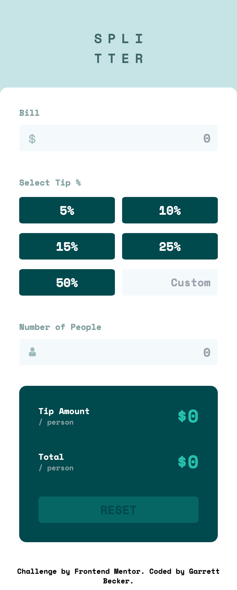

# Frontend Mentor - Tip Calculator Solution

This is my solution to the [Tip calculator challenge on Frontend Mentor](https://www.frontendmentor.io/challenges/tip-calculator-app-ugJNGbJUX). I'm super thankful to have found Frontend Mentor as a great way to confidently grow in my coding skills with real-life projects. 

## Table of contents

- [Frontend Mentor - Tip Calculator Solution](#frontend-mentor---tip-calculator-solution)
  - [Table of contents](#table-of-contents)
  - [Overview](#overview)
    - [Project Brief](#project-brief)
    - [Mobile View](#mobile-view)
    - [Desktop View](#desktop-view)
    - [Links](#links)
  - [My process](#my-process)
    - [Built with](#built-with)
    - [What I learned](#what-i-learned)
    - [Continued development](#continued-development)
    - [Useful resources](#useful-resources)
  - [Author](#author)
  - [Acknowledgments](#acknowledgments)

## Overview

### [Project Brief](./project%20brief/)

Your challenge is to build out this tip calculator app and get it looking as close to the design as possible.

You can use any tools you like to help you complete the challenge. So if you've got something you'd like to practice, feel free to give it a go.

Your users should be able to:

- View the optimal layout for the app depending on their device's screen size
- See hover states for all interactive elements on the page
- Calculate the correct tip and total cost of the bill per person

Want some support on the challenge? [Join our Slack community](https://www.frontendmentor.io/slack) and ask questions in the **#help** channel.

### Mobile View



### Desktop View


### Links

- [Solution URL](https://www.frontendmentor.io/solutions/tip-calculator-with-next-tailwind-S4saLJMW04)
- [Live Site URL](https://tip-calculator-gdbecker.netlify.app)

## My process

### Built with

- [React](https://reactjs.org/) - JS library
- [Next.js](https://nextjs.org) - React framework
- HTML5
- CSS
- [Tailwind CSS](https://tailwindcss.com) - CSS framework
- Mobile-first workflow
- [VS Code](https://code.visualstudio.com)

### What I learned

I really liked this challenge for getting more practice with Next and Tailwind to make a tip calculator - handy not just for frontend practice but also when I'm out with friends. There were quite a few features and styles to nail down with this one, including the responsive layout between screen sizes, styling for buttons and input fields, and especially for dynamically generating the calculations without actually clicking on a submit button.

I approached this mini app first by getting the overall look and layout down that I needed to match the design, starting first from the mobile view and then expanding up to larger screens (Tailwind makes this easy to do!) and then started tackling the calculator functionality. I kept all the main calc code contained within the "calc" component, and worked to add event listeners to each button/field on the form through Next's hooks and functions, so you would be able to dynamically print out the total amounts per person. The styling does usually take me the longest because I'm working without Figma files and want to match the design as closely as possible, but once I start getting into the JavaScript it goes smoothly - always helps to take on one small task at a time. 

Here are a few code samples from this project:

```html
<!-- Calculator result section structure -->
<div className="flex flex-col w-full min-h-max p-8 bg-veryDarkCyan rounded-xl justify-between">
  <div className="flex flex-col md:pt-6">
    <div className="flex flex-row justify-between pb-10">
      <div className="flex flex-col items-start justify-center text-left">
        <h1 className="text-white text-sm">Tip Amount</h1>
        <h2 className="text-grayishCyan-300 text-xs">/ person</h2>
      </div>
      <h1 className="flex items-center text-strongCyan text-3xl md:text-4xl">${tipPerPerson}</h1>
    </div>

    <div className="flex flex-row justify-between pb-10 md:pb-0">
      <div className="flex flex-col items-start justify-center text-left">
        <h1 className="text-white text-sm">Total</h1>
        <h2 className="text-grayishCyan-300 text-xs">/ person</h2>
      </div>
      <h1 className="flex items-center text-strongCyan text-3xl md:text-4xl">${totalPerPerson}</h1>
    </div>
  </div>

  <div className="flex flex-row md:align-bottom">
    <button 
      className={"w-full h-full py-2 text-center text-xl text-veryDarkCyan bg-strongCyan rounded-md hover:bg-grayishCyan-200 " + (tipPerPerson == 0 && totalPerPerson == 0 ? "opacity-25" : "")}
      onClick={() => reset()}
    >RESET
    </button>
  </div>
</div>
```

```javascript
// Click handler for each tip button
const tipButtonClick = (e) => {
  setSelectedTip(e.currentTarget.value);

  if (e.currentTarget.id == "custom") {
    setCustomTip(e.currentTarget.value);
  } else {
    setCustomTip('');
  }

  if (bill != '' && e.currentTarget.value != '' && numPeople != '' && numPeople != "0") {
    setTipPerPerson(calculateTipPerPerson(bill, e.currentTarget.value, numPeople));
    setTotalPerPerson(calculateTotalPerPerson(bill, e.currentTarget.value, numPeople));
  }
}
```

```javascript
// Calculating total cost per person
const calculateTotalPerPerson = (b, t, p) => {
  var solution = (((parseInt(t) / 100) * parseFloat(b)) + parseFloat(b)) / parseInt(p);
  return Math.round(solution * 100) / 100;
}
```

### Continued development

As a starter developer, I want to keep growing in working as a team and learning how to deliver smaller packages of code at a time, such as components like this one. I thought this project was a good way to get back into Next.js and begin doing just that!

### Useful resources

- [CSS Formatter](http://www.lonniebest.com/FormatCSS/) - I found this helpful site when I'm feeling lazy and don't want to format my CSS code, I can have this do it for me, especially putting everything in alphabetical order.
- [Tailwind Grid](https://tailwindcss.com/docs/grid-template-columns) - Handy guide from Tailwind's docs about using grid-cols to structure content

## Author

- Website - [Garrett Becker]()
- Frontend Mentor - [@gdbecker](https://www.frontendmentor.io/profile/gdbecker)
- LinkedIn - [Garrett Becker](https://www.linkedin.com/in/garrett-becker-923b4a106/)

## Acknowledgments

Thank you to the Frontend Mentor team for providing all of these fantastic projects to build, and for our getting to help each other grow!