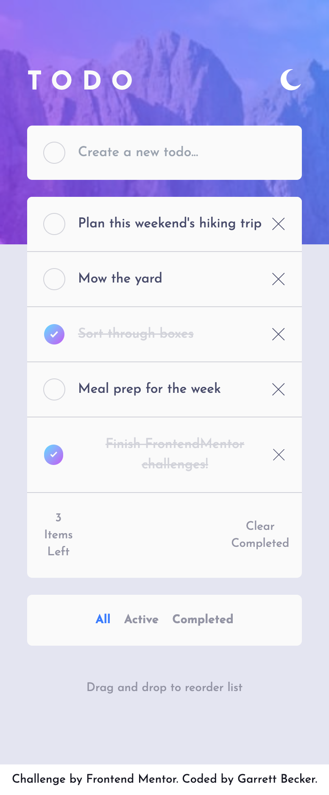
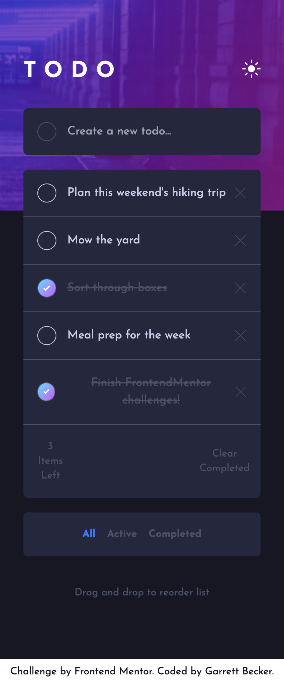
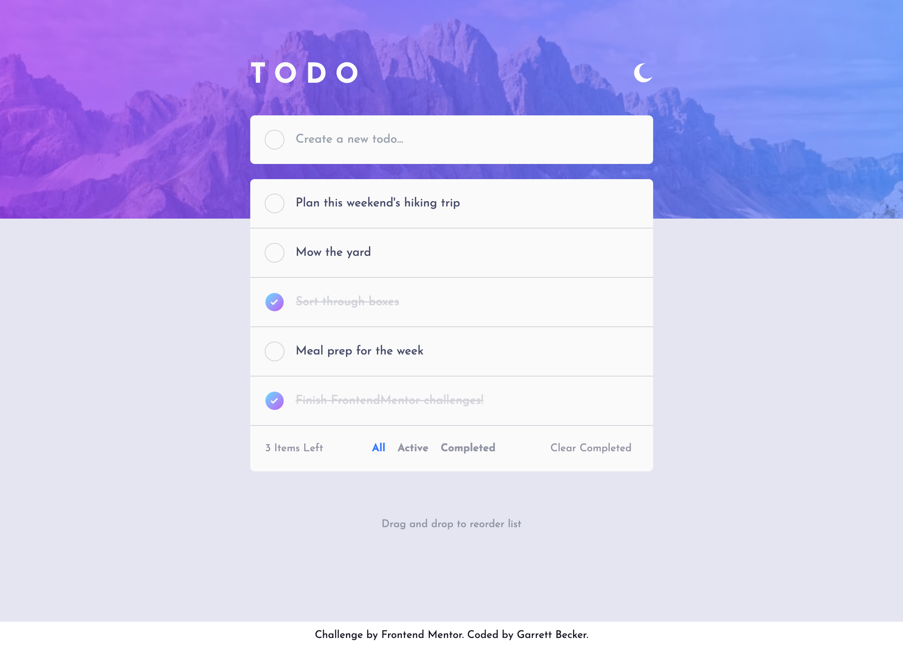
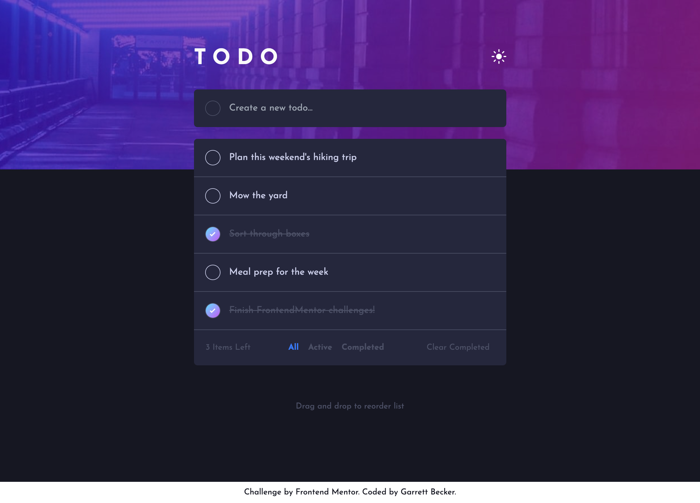

# Frontend Mentor - Todo App Solution

This is my solution to the [Todo app challenge on Frontend Mentor](https://www.frontendmentor.io/challenges/todo-app-Su1_KokOW). I'm super thankful to have found Frontend Mentor as a great way to confidently grow in my coding skills with real-life projects. 

## Table of contents

- [Frontend Mentor - Todo App Solution](#frontend-mentor---todo-app-solution)
	- [Table of contents](#table-of-contents)
	- [Overview](#overview)
		- [Project Brief](#project-brief)
		- [Mobile View - Light Mode](#mobile-view---light-mode)
		- [Mobile View - Dark Mode](#mobile-view---dark-mode)
		- [Desktop View - Light Mode](#desktop-view---light-mode)
		- [Desktop View - Dark Mode](#desktop-view---dark-mode)
		- [Links](#links)
	- [My process](#my-process)
		- [Built with](#built-with)
		- [What I learned](#what-i-learned)
		- [Continued development](#continued-development)
		- [Useful resources](#useful-resources)
	- [Author](#author)
	- [Acknowledgments](#acknowledgments)

## Overview

### [Project Brief](./project%20brief/)

Your challenge is to build out this todo app and get it looking as close to the design as possible.

You can use any tools you like to help you complete the challenge. So if you've got something you'd like to practice, feel free to give it a go.

Your users should be able to:

- View the optimal layout for the app depending on their device's screen size
- See hover states for all interactive elements on the page
- Add new todos to the list
- Mark todos as complete
- Delete todos from the list
- Filter by all/active/complete todos
- Clear all completed todos
- Toggle light and dark mode
- **Bonus**: Drag and drop to reorder items on the list

Want some support on the challenge? [Join our Slack community](https://www.frontendmentor.io/slack) and ask questions in the **#help** channel.

### Mobile View - Light Mode



### Mobile View - Dark Mode



### Desktop View - Light Mode



### Desktop View - Dark Mode




### Links

- [Solution URL](https://www.frontendmentor.io/solutions/todo-app-with-nextjs-tailwind-firebase-3CyqBuYLnn)
- [Live Site URL](https://todo-app-gdbecker.netlify.app/)

## My process

### Built with

- [React](https://reactjs.org/) - JS library
- [Next.js](https://nextjs.org) - React framework
- HTML5
- CSS
- [Tailwind CSS](https://tailwindcss.com) - CSS framework
- Mobile-first workflow
- [VS Code](https://code.visualstudio.com)

### What I learned

I was excited to see this challenge and take it on because I wanted more practice with some of the specifics here, such as the light/dark theme and figuring out the right structure, but also because I wanted to figure out how to implement Firebase storage and take on the drag/drop reordering. Starting out, I worked on making sure that Tailwind was set up with variables and that the light/dark theme could be switched easily on the main page. I also designed the page alongside each todo hard-keyed at first to make sure that I got the look and design right before separating the todos out to their own component and then pulling each one in with a map function.

It was totally worth it spending the time to figure out how Google's Firebase storage worked and how I could implement this app to work with it. From configuring the projects folder in the Firebase console to dynamically storing and pulling data to this app and then hiding the configuration variables with a .env file, each step provided great challenges and kinks to persevere through to make everything work out! It built my confidence and assurance that I can figure out anything when I'm given the time and freedom to explore and try things. 

The drag/drop functionality was probably the trickiest part to implement, but even when it became difficult and all those errors kept coming, I didn't want to give up. It may not be the most elegant solution, but I'm happy with how the logic functions. It basically switches out the "list indexes" of each todo (that are a separate variable from the todo's primary identity) that tell the app what order to show them on the page, and sends Firebase the updated todos' information. Everything was then modified for smaller, mobile screens and I could call this projected completed! I'm proud of this one, grateful for the practice and I used what I learned here to build my showcase site for all my Frontend Mentor projects.

Here are a few code samples from this project:

```html
<!-- Todo component structure and Tailwind styling -->
<div 
	key={listIndex} 
	className="flex flex-row w-full rounded-tl-md rounded-tr-md justify-between p-5 items-center bg-lightTheme-100 dark:bg-darkTheme-200 border-b-[1px] border-lightTheme-300 dark:border-darkTheme-600 group"
	onDragStart={(e) => dragStart(e, listIndex, id)}
	onDragEnter={(e) => dragEnter(e, listIndex, id)}
	onDragEnd={drop}
	draggable
>
	<div className="flex flex-row items-center">
		<button 
			className={"flex p-0.5 w-6 h-6 rounded-full ring-1 group-hover:ring-lightTheme-100 group-hover:bg-gradient-to-br group-hover:from-checkBgFrom group-hover:to-checkBgTo dark:group-hover:ring-darkTheme-200 group " + (isChecked ? "ring-lightTheme-100 dark:ring-darkTheme-600 bg-gradient-to-br from-checkBgFrom to-checkBgTo" : "ring-lightTheme-300 dark:ring-darkTheme-300 dark:hover:ring-darkTheme-200")}
			onClick={(event) => checkHandler(event, todo)}>
			<div 
				className="flex px-[0.3rem] py-[0.38rem] rounded-full group-hover:bg-lightTheme-100 dark:group-hover:bg-darkTheme-200"
				id={id}>
				<Image 
					id={id} 
					src={(!isChecked && darkMode ? IconCheckDark : IconCheckLight)} 
					alt="Icon" 
					width={12} 
					height={12} 
					className="" 
				/>
			</div>
		</button>
		<button 
			className={"pl-4 " + (isChecked ? "line-through text-lightTheme-300 dark:text-darkTheme-600" : "text-lightTheme-500 dark:text-darkTheme-300")}
			id={id}
			onClick={(event) => checkHandler(event, todo)}
		>{todo}</button>
	</div>
	<button 
		className="flex lg:invisible group-hover:visible"
		onClick={() => deleteTodo(id)}>
		<Image src={IconCross} alt="Icon" width={15} height={15} className="" />
	</button>
</div>
```

```css
/* Styling was completed with Tailwind, but I imported a couple of font files within globals.css */
@font-face {
  font-family: JosefinSans-Regular;
  src: url(../../public/JosefinSans-Regular.ttf);
}

@font-face {
  font-family: JosefinSans-Bold;
  src: url(../../public/JosefinSans-Bold.ttf);
}

```

```js
// Drag and drop functionality
const dragItem = useRef();
const dragItemId = useRef();
const dragOverItem = useRef();
const dragOverItemId = useRef();

const dragStart = (e, position, id) => {
	dragItem.current = position;
	dragItemId.current = id;
};

const dragEnter = (e, position, id) => {
	dragOverItem.current = position;
	dragOverItemId.current = id;
};

const drop = async (e) => {
	if (filter == "All") {
		const copyTodos = [...todos];

		let selectedTodo = copyTodos.filter(todo => todo.listIndex === dragItem.current)[0];
		let selectedTodoIndex = copyTodos.indexOf(selectedTodo);

		let overTodo = copyTodos.filter(todo => todo.listIndex === dragOverItem.current)[0];
		let selectedOverTodoIndex = copyTodos.indexOf(overTodo);

		copyTodos[selectedTodoIndex].listIndex = dragOverItem.current;
		copyTodos[selectedOverTodoIndex].listIndex = dragItem.current;

		copyTodos.sort(function(first, second) {
			return first.listIndex - second.listIndex;
		});

		// Update new listIndex values to db (switch em)
		try {
			const docRefDragItem = doc(db, "todo", dragItemId.current);
			await runTransaction(db, async (transaction) => {
				const todoDoc = await transaction.get(docRefDragItem);
				if (!todoDoc.exists()) {
					throw "Document does not exist!";
				}
				transaction.update(docRefDragItem, { listIndex: dragOverItem.current});
			});
		} catch (error) {
			console.log("Transaction failed: ", error);
		}

		try {
			const docRefDragOverItem = doc(db, "todo", dragOverItemId.current);
			await runTransaction(db, async (transaction) => {
				const todoDoc = await transaction.get(docRefDragOverItem);
				if (!todoDoc.exists()) {
					throw "Document does not exist!";
				}
				transaction.update(docRefDragOverItem, { listIndex: dragItem.current});
			});
		} catch (error) {
			console.log("Transaction failed: ", error);
		}

		dragItem.current = null;
		dragOverItem.current = null;
		setTodo(copyTodos);
		setFilteredTodos(copyTodos);
		setChecked(copyTodos);
	}
};
```

### Continued development

As a starter developer, I want to keep growing in working as a team and learning how to deliver smaller packages of code at a time, such as robust and beautiful pages like this one. I thought this project was a good way to get back into Next.js and begin doing just that!

### Useful resources

- [CSS Formatter](http://www.lonniebest.com/FormatCSS/) - I found this helpful site when I'm feeling lazy and don't want to format my CSS code, I can have this do it for me, especially putting everything in alphabetical order.
- [Tailwind Grid](https://tailwindcss.com/docs/grid-template-columns) - Handy guide from Tailwind's docs about using grid-cols to structure content

## Author

- Website - [Garrett Becker]()
- Frontend Mentor - [@gdbecker](https://www.frontendmentor.io/profile/gdbecker)
- LinkedIn - [Garrett Becker](https://www.linkedin.com/in/garrett-becker-923b4a106/)

## Acknowledgments

Thank you to the Frontend Mentor team for providing all of these fantastic projects to build, and for our getting to help each other grow!